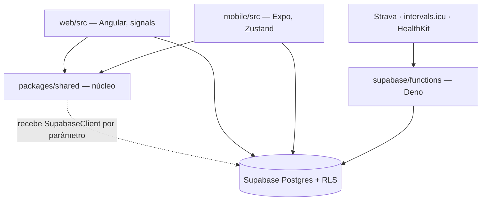

# Architecture Spine — Orbe

## Design Paradigm

**Núcleo compartilhado com adaptadores de plataforma.** `packages/shared` é o núcleo: domínio, cálculo, vocabulário e contrato de dados, sem nenhuma API de plataforma. `web/src` e `mobile/src` são adaptadores: interface, máquina de estado e ligações nativas. `supabase/` é persistência e a fronteira com serviços externos.

A direção de dependência é única e não tem exceção:



Proibido: `shared` importar de `web` ou `mobile`; `web` e `mobile` importarem um do outro; `shared` construir um `SupabaseClient`.

## Invariants & Rules

### AD-1 — Fronteira mecânica entre núcleo e adaptador

- **Binds:** todo módulo em `packages/shared`, `web/src`, `mobile/src`
- **Prevents:** duplicação por deriva — cinco pares de lógica idêntica divergindo hoje, com 85% de co-change
- **Rule:** módulo que não importa API de plataforma (nativa, Angular, React ou React Native) pertence a `packages/shared`. O critério é o conjunto de imports, nunca um julgamento sobre o que "é domínio".

### AD-2 — Arquivo que mistura é partido

- **Binds:** todo arquivo que combine ligação de plataforma com lógica pura
- **Prevents:** derrotar a AD-1 por co-locação — um store importa `signal()`, fica no app e leva a query pura junto
- **Rule:** arquivo misto é dividido antes de aplicar a AD-1; a metade pura sobe para o núcleo. A AD-1 vale para o módulo resultante, não para o arquivo original.

### AD-3 — Dono único do vocabulário de domínio

- **Binds:** taxonomia de tipos de atividade e todo conjunto de constantes de domínio
- **Prevents:** dois donos da mesma entidade — `GPS_ACTIVITY_IDS` definido em web e mobile enquanto o núcleo detém apenas os rótulos
- **Rule:** cada conceito de domínio tem exatamente um módulo dono em `packages/shared`. Redefinir constante de domínio fora do núcleo é proibido. Antes de criar um módulo novo, o conceito é procurado no núcleo: existindo dono, o código entra nele — um segundo módulo com outro nome para o mesmo conceito viola esta AD tanto quanto uma cópia.

### AD-4 — Contrato de schema no núcleo, client injetado

- **Binds:** todo acesso a tabela do Supabase (139 chamadas hoje, 14 tabelas em comum entre os apps)
- **Prevents:** schema escrito à mão em dois apps, com filtros que já divergem
- **Rule:** query vive em `packages/shared/src/data/` e recebe `SupabaseClient` como parâmetro. O app constrói o client — o adaptador de storage difere — e não escreve query. Cada tabela tem exatamente um módulo dono do seu acesso, e esse módulo devolve modelo de domínio de `models/`, nunca linha crua do Postgres.

### AD-5 — Banco como exceção nomeada

- **Binds:** qualquer proposta de mover lógica para view, função ou coluna gerada
- **Prevents:** empurrar lógica ao banco por preferência, pagando atrito de migration manual sem ganho medido
- **Rule:** só quando o ganho for reduzir payload na rede ou colapsar round-trip; precedente é `activity_routes.route_overview`. View exige `security_invoker = true`. RPC não se aplica onde o cliente precise escolher colunas.

### AD-6 — Edge function só para integração com segredo

- **Binds:** `supabase/functions/`
- **Prevents:** regra de negócio migrando para um runtime sem teste local nem CI
- **Rule:** edge function existe para integração externa que exija segredo server-side. Lógica de negócio fica no núcleo.

### AD-7 — Guarda mecânica no teste

- **Binds:** `npm run test` na raiz
- **Prevents:** AD-1 a AD-4 virarem prosa não verificada — não há CI nem git hooks neste repositório
- **Rule:** o teste falha quando um basename duplica entre `web/src` e `mobile/src` fora da allowlist de stores; quando existe `.from(` fora de `packages/shared/src/data/`; quando o núcleo importa de um app; ou quando o núcleo constrói um `SupabaseClient`. A guarda vive no workspace do núcleo e só vale onde executa — guarda que não roda é pior que guarda nenhuma, porque passa a impressão de cobertura. Uma checagem cujo passivo ainda está sendo drenado entra como **catraca** (falha só se o número crescer) e vira barreira ao chegar a zero; declarar barreira cedo demais derruba o build em massa e o teste é desligado na primeira hora.

### AD-8 — Instância Supabase única [ADOPTED]

- **Binds:** mobile (dev, preview, produção) e web
- **Prevents:** supor isolamento de ambiente que não existe
- **Rule:** uma instância serve todos os ambientes; todo trabalho de desenvolvimento escreve em dado real. Migration só com confirmação explícita; DDL destrutivo nunca sem aval.

### AD-9 — Build do web não injeta segredo

- **Binds:** `web/src/environments/`, pipeline de publicação
- **Prevents:** etapa de substituição de placeholder que já existe morta no repositório e engana quem a encontra
- **Rule:** a anon key é pública e protegida por RLS; fica versionada em um único arquivo de environment. O build de produção não substitui arquivo nem injeta segredo.

### AD-10 — Conhecimento estratificado por volatilidade

- **Binds:** `docs/`, `_bmad-output/`, `AGENTS.md`, `CLAUDE.md`
- **Prevents:** documentação apodrecendo por misturar o durável com o descartável
- **Rule:** o que é derivável do código não se escreve. Regra operacional verificada vai no bloco de `AGENTS.md`. Durável — o que segue verdadeiro depois da feature entregue: spec, modelo de dados, rationale de decisão — vai em `docs/`. Efêmero — o que morre na entrega: lista de tarefas, tracking de sprint — vai em `_bmad-output/`. A classificação é pelo conteúdo, nunca pelo nome do arquivo: um `plan.md` que carrega decisões técnicas é durável.

### AD-11 — ADR é imutável

- **Binds:** `docs/decisions/`
- **Prevents:** registro de decisão virando documento vivo, que envelhece como todo documento vivo
- **Rule:** ADR é numerada e append-only. Mudar de ideia não edita a ADR: escreve outra que a supersede, citando a anterior.

### AD-12 — Estado é do app; query, cálculo e vocabulário não são

- **Binds:** os 10 pares de store duplicados
- **Prevents:** a máquina de estado servir de esconderijo para lógica compartilhável
- **Rule:** cada app é dono da sua máquina de estado — signals no web, Zustand no mobile. Não é dono de query, cálculo nem vocabulário de domínio.

### AD-13 — Target de teste não pode ser stub

- **Binds:** o script `test` de todo workspace
- **Prevents:** suíte verde que não executa nada — `packages/shared` tem três arquivos de teste e um script `echo 'No tests yet'`, e eles nunca rodaram
- **Rule:** workspace cujo `npm test` não executa um runner de verdade não declara target `test`. Falhar é aceitável; mentir que passou, não.

### AD-14 — Resolução isolada de dependências

- **Binds:** a árvore de `node_modules` do monorepo inteiro e toda dependência declarada por qualquer workspace
- **Prevents:** colisão entre workspaces numa árvore plana — o TypeScript do mobile derrubando o build do web pelo `@angular/compiler-cli` hasteado, e a segunda cópia de `react`/`react-native` que peers curinga produzem quando um app pina versão exata
- **Rule:** a árvore é isolada: cada workspace enxerga apenas o que declara. Hoisting é exceção pontual, nomeando a biblioteca e o motivo — nunca global. Dependência usada sem ser declarada é defeito, não conveniência. `overrides` que exista só para desfazer colisão de hoisting é sintoma desta AD não valer, e sai quando ela passar a valer.
- **Corolário — singleton:** pacote que precisa ser **uma só instância** no bundle é declarado como tal e hasteado de propósito, com o motivo nomeado. São três os motivos válidos: carregar patch, guardar estado global, ou servir de identidade de tipo entre workspaces. Sem isso, o isolamento multiplica cópias onde a corretude exige uma — `@supabase/supabase-js` é declarado pelo núcleo **e** pelos apps, e o bundler do mobile alcança a cópia do núcleo.

### AD-15 — Piso de TypeScript do núcleo

- **Binds:** `packages/shared` e a versão de `typescript` de cada consumidor
- **Prevents:** o núcleo adotar recurso de linguagem que um consumidor não compila. O shared não tem build — `main` e `types` apontam para `src/index.ts` e os dois apps o consomem como **fonte**, cada um com o seu compilador
- **Rule:** `packages/shared` linta com a **menor** versão de TypeScript entre seus consumidores. Alinhar as três não é objetivo nem é possível: o toolchain do Angular veta TS ≥ 6 e o mobile segue o que o Expo SDK pina. Subir o piso exige subir todos os consumidores antes. Quem impõe é a AD-17 — o build do web no portão automatizado é o que reprova um recurso só-TS6 que entre no núcleo; sem aquele portão, esta AD é prosa.

### AD-16 — Cadência de plataforma N-1, com exceção nomeada

- **Binds:** Expo SDK, React Native, Angular — toda plataforma de release cadenciado
- **Prevents:** os dois extremos. O salto acumulado (esta migração pagou três SDKs de uma vez, e o degrau do meio foi o único que exigiu mudança de código) e o represamento em defeito conhecido
- **Rule:** ficar um release *stable* atrás do mais novo. Exceção: quando o mais novo corrigir defeito que afeta o app, sobe direto — precedente é a regressão de memória do Hermes V1, presente no SDK 56 e corrigida no 57.

### AD-17 — O portão automatizado cobre os três workspaces; o device é fronteira nomeada

- **Binds:** toda mudança que toque o lockfile ou um manifesto, e todo upgrade de plataforma
- **Prevents:** quebra atravessando workspace sem ninguém ver — o mobile subiu para TypeScript 6 e o build do web caiu, com a suíte do mobile verde o tempo todo
- **Rule:** a integração contínua valida os **três** workspaces a cada mudança de dependência. Ela **não** cobre build nativo iOS nem os portões em device: verde no portão automatizado nunca significa feature funcionando. Upgrade de SDK só fecha com os portões em aparelho, mais o exercício das features que tocam API de plataforma — exportar, compartilhar, galeria, câmera, notificações.

### AD-18 — Patch é declarado no gerenciador e falha alto

- **Binds:** `patches/` e todo pacote corrigido localmente
- **Prevents:** patch deixando de aplicar **em silêncio**. O sintoma aparece longe da causa: erro de bundle, ou dado que simplesmente para de chegar
- **Rule:** patch é declarado no manifesto do gerenciador, com falha de patch não aplicado derrubando a instalação. Chave por faixa de versão, nunca por versão exata — versão exata que deixa de casar é pulada calada. O patch cobre **toda cópia que chega a um bundler**, não a cópia de um workspace: pacote com patch é singleton pela AD-14. Todo upgrade do pacote reverifica o patch; quando o que ele sustenta é comportamento nativo, a reverificação é em device (ADR 0013).

## Consistency Conventions

| Concern | Convention |
| --- | --- |
| Nomeação de entidade | Um nome por conceito em todo o sistema, do Postgres ao componente. Tabela e módulo dono usam o mesmo termo. |
| Arquivos e símbolos | `kebab-case` para arquivo; `PascalCase` para classe e componente; `camelCase` para função e hook. |
| Data e hora | Data local no formato `YYYY-MM-DD` derivada da timezone do dispositivo, nunca UTC. Instante em ISO 8601. |
| Leitura de tabela grande | Colunas explícitas; `select('*')` proibido em tabela com payload grande. |
| Mutação de estado | Só o adaptador muta estado. Função do núcleo é pura e imutável — recebe e devolve, não altera a entrada. |
| Segredos | Anon key é pública e versionada. Segredo real só em edge function; `.env` e `mobile/.env` nunca são lidos, editados nem commitados. |
| Artefato gerado | `mobile/ios/`, o lockfile e `patches/` mudam pela ferramenta que os gera, nunca à mão. `mobile/ios/` não é versionado — é saída de `expo prebuild`. |
| Dependência de plataforma | Quem manda na versão é o SDK, não a preferência: no mobile, `expo install` decide; no web, o toolchain do Angular. Bump avulso de nativa de terceiro é desvio a justificar. |

## Stack

| Name | Version |
| --- | --- |
| TypeScript | 6.0 no mobile · 5.9 no web (teto do Angular) · piso do núcleo pela AD-15 |
| Angular (web) | 21 |
| Vitest (web) | 4 |
| Expo | 57 |
| React Native | 0.86.2 |
| React | 19.2.3 |
| Zustand (mobile) | 5 |
| Jest (mobile) | 29 |
| @supabase/supabase-js | 2.106 no mobile (versão com patch) |
| Supabase | Postgres + RLS + edge functions Deno |

O mobile está preso à SDK do Expo: subir React Native exige subir a SDK inteira. Desde a ADR 0012 `mobile/ios/` é **gerado** por `expo prebuild` e não é versionado — o salto voltou a ser bump, não merge de projeto nativo. A entrega em background do HealthKit depende de um patch local (ADR 0013), o que faz a AD-18 valer aqui com peso: o que se perde não quebra build nem teste, só para de chegar dado.

Duas versões de TypeScript convivendo é estado esperado, não desleixo: o Angular veta TS ≥ 6 e o Expo pina TS 6. A AD-15 é o que impede isso de virar defeito.

## Structural Seed

```text
packages/shared/src/
  data/          # AD-4 — queries, client injetado por parâmetro
  models/        # tipos de domínio, sem lógica
  constants/     # AD-3 — vocabulário; um dono por conceito
  fitness/ health/ goals/ week/ period/ chart/ geo/    # cálculo puro

web/src/app/
  core/supabase/ # constrói o client (localStorage)
  features/      # componentes + stores de signals

mobile/src/
  lib/           # adaptadores nativos (HealthKit, tipos de workout)
  store/         # stores Zustand
  app/           # rotas Expo Router

supabase/
  migrations/    # ledger append-only; aplicada nunca é reescrita
  functions/     # AD-6 — só integração com segredo

docs/
  decisions/     # AD-11 — ADRs, append-only
  specs/         # durável: spec.md + data-model.md por feature

_bmad-output/    # AD-10 — efêmero: plan, tasks, sprint
```

## Deferred

| Item | Condição de revisita |
| --- | --- |
| Alvo de hospedagem do web | Ao publicar. Recomendação: SPA estática em host estático — a AD-9 já elimina a necessidade de injetar segredo no build. |
| Troca do gerenciador de pacotes (alvo: pnpm, `nodeLinker` isolado) | A AD-14 fixa o isolamento como invariante; a troca em si acontece em fase própria, com os portões em device no fim. Não junto de um upgrade de SDK — misturar as duas fontes de quebra foi justamente o que se decidiu evitar. O primeiro trabalho da fase é a lista de singletons da AD-14, `@supabase/supabase-js` à frente. |
| Bot de atualização (Renovate/Dependabot) | Quando a AD-17 estiver de pé e a cadência da AD-16 se mostrar trabalhosa de conduzir à mão. Antes disso, seria PR automático sem portão que o valide. |
| Migrar `patches/` para o formato do gerenciador | Junto da troca do gerenciador (AD-14/AD-18) — o formato de arquivo e a chave mudam, e o patch do HealthKit exige reverificação em device. |
| Segunda instância Supabase para desenvolvimento | Quando houver um segundo usuário real, ou quando uma perda de dado em desenvolvimento custar mais que manter dois schemas em sincronia. |
| Comentários `.claude/specs` nas 28 migrations aplicadas | Nunca por si só — migration aplicada não se reescreve. O tombstone em `.claude/specs/README.md` resolve o ponteiro. |
| `running-highlights.ts` duplicado entre os apps | Quando alguém encostar em highlights. `ActivityHighlight` carrega `value` e `caption` já formatados — separar cálculo de apresentação é o que a AD-2 manda, mas muda o contrato que os componentes consomem. |
| `drop` de `user_profiles` | Opcional e bem-informado: `n_tup_ins = 0` (nunca recebeu insert), nenhum código a referencia, comentário no banco já a marca obsoleta. Falta só a decisão de derrubar. |
