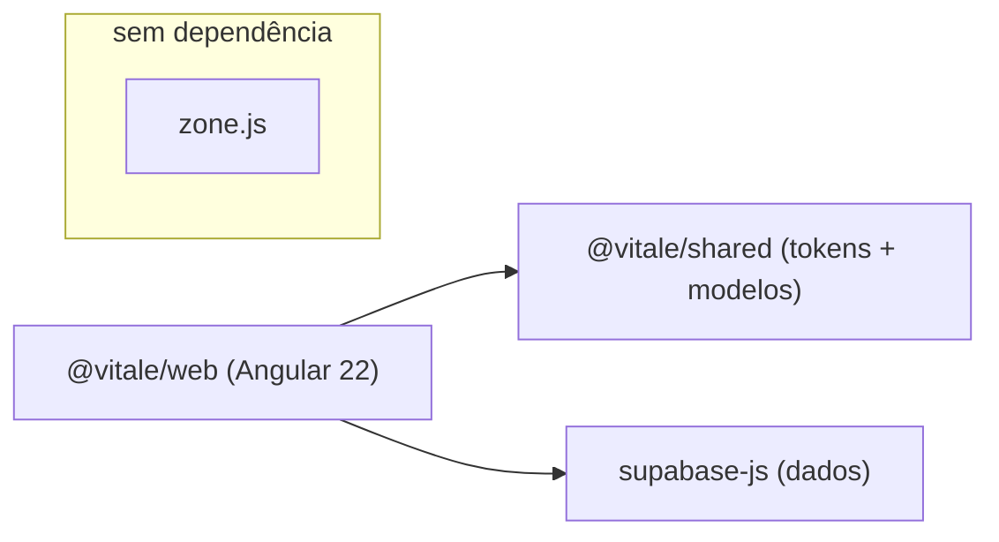
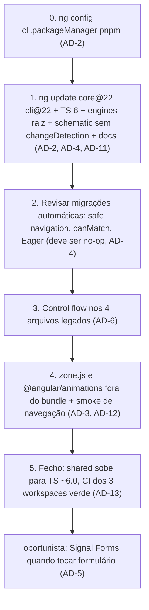

# Architecture Spine — Migração Angular 22

## Design Paradigm

SPA **standalone signal-first**: componentes standalone com estado em `signal()`
/ `computed()`, detecção OnPush, features fatiadas em
`web/src/app/features/<modulo>/` com rotas lazy (`loadComponent`) declaradas em
`web/src/main.ts`. A migração **não muda o paradigma** — ela remove o que o
contradizia (zone.js) e adota as APIs que o completam (Signal Forms).

## Invariants & Rules

> Os IDs `AD-n` abaixo são **locais deste spine**. Não confundir com os
> `AD-1..AD-17` do AGENTS.md do repo — cite-os como "AD-n da migração".

### AD-1 — Paradigma e estrutura ficam como estão `[ADOPTED]`

- **Binds:** all
- **Prevents:** a migração virar reestruturação (app.routes.ts, NgModules, pastas novas)
- **Rule:** rotas continuam em `web/src/main.ts`; nenhum arquivo de rota novo,
  nenhum NgModule, nenhuma pasta fora de `features/<modulo>/`. Migração só toca
  versão, bootstrap, e os arquivos listados nos ADs abaixo.

### AD-2 — Alvo: Angular 22.x + TypeScript 6.x + Node ≥ 22, via `ng update`

- **Binds:** all
- **Prevents:** bump manual de `package.json` que pula os schematics de migração
- **Rule:** passo zero obrigatório: `pnpm exec ng config cli.packageManager pnpm`
  — o `angular.json` não declara gerenciador e um `ng update` que caia no npm
  recria a árvore plana que o ADR 0016 baniu. Só então
  `pnpm exec ng update @angular/core@22 @angular/cli@22` (dentro de `web/`),
  deixando os schematics automáticos rodarem (safe-navigation, `canMatch`,
  Eager). `typescript` sobe para `~6.0`; `engines.node` da **raiz** sobe de
  `>=20` para `>=22` no mesmo PR (o CI já roda Node 22; o range oficial do
  Angular 22 é `^22.22.3 || ^24.15.0 || ^26.0.0` — versão ímpar não serve).
  Nada de editar versões à mão antes do update.

### AD-3 — zone.js sai do bundle no mesmo epic

- **Binds:** all
- **Prevents:** peso morto no bundle e a ilusão de que o app "ainda depende de zone"
- **Rule:** o scheduler zoneless é o **default desde a v21** — o bootstrap do
  Orbe não pede `provideZoneChangeDetection()`, logo o app **já roda zoneless
  hoje**, com zone.js carregado porém inerte. O passo remove o peso morto:
  `"polyfills": ["zone.js"]` sai do `angular.json` e a dependência `zone.js`
  sai do `package.json`; opcionalmente `provideZonelessChangeDetection()`
  entra no bootstrap para deixar a escolha explícita no código. Reintroduzir
  zone (`provideZoneChangeDetection()`, polyfill, patches) é proibido. Toda
  mudança de estado visível passa por `signal`/`computed`. Smoke de navegação
  rápido no PR por higiene — o risco de runtime já foi absorvido no uso
  diário desde a subida para a v21.

### AD-4 — `changeDetection` explícito vira redundância: código novo omite

- **Binds:** all
- **Prevents:** metade dos componentes declarando OnPush e metade não, sem regra
- **Rule:** com OnPush como padrão da v22, o schematic de `component` no
  `angular.json` perde a linha `"changeDetection": "OnPush"` **no mesmo PR do
  `ng update`** (sem janela entre defaults). Componente novo não declara
  estratégia; os 87 componentes existentes **ficam intactos** (sem diff em
  massa). `ChangeDetectionStrategy.Eager` (ou `Default`) é proibido — a
  migração automática que o adicionaria não deve produzir mudança alguma aqui;
  se produzir, é sinal de componente fora do padrão, a corrigir e não a aceitar.

### AD-5 — Formulários novos usam Signal Forms

- **Binds:** features com editores (registros, hábitos, metas, compras, tasks, auth)
- **Prevents:** três estilos de formulário (ngModel, reactive, signal) convivendo sem regra
- **Rule:** formulário novo usa Signal Forms (estável na v22). Os 10 arquivos
  com `ngModel` migram **quando tocados** — "tocar" = alterar a lógica do
  formulário (campos, validação, submit); a conversão mecânica de control
  flow do AD-6 **não** conta como tocar. Não em big-bang; `FormGroup`/
  `FormBuilder` novos são proibidos. Enquanto um editor não for migrado, ele
  permanece 100% `ngModel` — sem híbrido dentro do mesmo formulário.

### AD-6 — Control flow: o legado `*ngIf`/`*ngFor` sai neste epic

- **Binds:** registro-editor, habit-editor, habit-list, planned-workout-editor
- **Prevents:** os dois dialetos de template seguirem convivendo (69 arquivos em `@if`, 4 em `*ngIf`)
- **Rule:** rodar `pnpm exec ng generate @angular/core:control-flow` nos 4
  arquivos restantes **logo após o `ng update`, antes do passo zoneless** —
  é o passo mecânico do epic e precede qualquer migração de formulário
  (AD-5). `*ngIf`/`*ngFor`/`[ngSwitch]` em código novo é proibido
  (deprecados desde a v20).

### AD-7 — Rotas aceitam o novo default `paramsInheritanceStrategy: 'always'`

- **Binds:** web/src/main.ts
- **Prevents:** rota aninhada futura lendo param do pai por acidente — ou contando que não herda
- **Rule:** não fixar `paramsInheritanceStrategy` no `provideRouter` (o default
  'always' vale). As rotas hoje são planas, então nada muda; quem aninhar rota
  amanhã já projeta sabendo que params do pai chegam ao filho.

### AD-8 — `@Service` só em serviço novo, e só a partir da 22.1

- **Binds:** web/src/app/core, services de feature
- **Prevents:** codemod em massa nos 17 serviços existentes misturado ao diff da migração; API developer-preview em produção
- **Rule:** `@Service` ficou estável na **22.1** (era developer preview na
  22.0) — o alvo do epic já é `^22.1`, então serviço root novo usa `@Service`;
  os `@Injectable({ providedIn: 'root' })` existentes migram quando tocados.
  Os dois formatos são equivalentes em runtime — a regra é só sobre código novo.

### AD-9 — Testes: Vitest do `@angular/build`, sem patch de zone

- **Binds:** web (testes)
- **Prevents:** teste que reintroduz zone.js via `zone.js/plugins/vitest-patch`
- **Rule:** o runner segue `@angular/build:unit-test` + Vitest (já é o caso).
  Como o app é zoneless (AD-3), o patch de zone para Vitest é proibido, assim
  como `fakeAsync`/`waitForAsync` em teste novo (hoje há zero uso — o custo é
  nulo); tempo em teste se controla com `vi.useFakeTimers()` e
  `fixture.whenStable()`. Teste que precise de zone está testando errado.

### AD-10 — Sufixos de arquivo ficam, apesar do style guide v20

- **Binds:** all
- **Prevents:** arquivos novos `user.ts` convivendo com 17 features em `*.component.ts`
- **Rule:** o repo mantém `*.component.ts`, `*.service.ts`, `*.guard.ts` — o
  style guide sem sufixo (v20+) **não** é adotado aqui. Consistência com o
  existente vale mais que a convenção nova.

### AD-11 — Docs autoritativos mudam no mesmo PR que a convenção

- **Binds:** web/AGENTS.md, CLAUDE.md
- **Prevents:** o AGENTS.md (que "vale em divergência") seguir mandando declarar OnPush enquanto o AD-4 manda omitir
- **Rule:** todo PR deste epic que altera uma convenção registrada em
  `web/AGENTS.md` ou `CLAUDE.md` (OnPush explícito, zone.js, formulários,
  versões de stack) atualiza o doc **no mesmo PR**. Doc divergente do spine é
  bug do PR, não tarefa futura.

### AD-12 — `@angular/animations` sai junto

- **Binds:** web/src/main.ts, web/package.json
- **Prevents:** dependência morta e deprecada (v20.2+) sobrevivendo à migração por inércia
- **Rule:** `provideAnimationsAsync()` sai do bootstrap e `@angular/animations`
  sai do `package.json` — zero uso real de `trigger()` no app (o único match é
  método homônimo em store). Animação nova é CSS; reintroduzir o pacote exige
  decisão registrada.

### AD-13 — `@vitale/shared` sobe para TS ~6.0 no fecho do epic

- **Binds:** packages/shared
- **Prevents:** contradição com o AD-15 do repo ("shared usa o menor TS entre consumidores") — o mobile já está em TS ~6.0.3, e com o web em 6.0 não sobra consumidor abaixo de 6
- **Rule:** último passo do epic: `typescript` do shared sobe de `~5.8` para
  `~6.0`, e o portão é o CI **dos três workspaces** (shared lint+test, web
  build+test, mobile tsc+jest) — o lockfile é um só, mudança de dependência
  valida o monorepo inteiro.

## Consistency Conventions

| Concern | Convention |
| --- | --- |
| Naming | kebab-case em arquivo, PascalCase em classe, prefixo `rt`; sufixos mantidos (AD-10) |
| Estado | `signal()`/`computed()` local; derivação nunca em método chamado no template |
| Cor / tema | nunca hex em tela — `resolveTokens()` / `moduleOf()` do `@vitale/shared` |
| Dados | supabase-js direto (sem HttpClient); fetch em ranges com `order` (teto de 1000 linhas do PostgREST) |
| Validação | PR de código: `pnpm --filter @vitale/web build` + `test`. PR que toca dependência/lockfile: CI completo dos três workspaces (AD-13) |

## Stack

| Name | Version |
| --- | --- |
| Angular (core/cli/build) | ^22.1.0 (patch corrente 22.1.4, 27/08/2026) |
| TypeScript | ~6.0 (range oficial `>=6.0.0 <6.1.0`) |
| Node | `^22.22.3 \|\| ^24.15.0 \|\| ^26.0.0` |
| Vitest | ^4 |
| RxJS | ~7.8 |
| zone.js | — (removido no AD-3) |
| supabase-js | ^2.x (inalterado) |
| pnpm | via `packageManager` / corepack (ADR 0016) |

## Structural Seed

Ordem de execução — cada passo deixa `build` + `test` verdes antes do próximo:

## Deferred

- **SSR / hydration incremental** — o app é SPA client-side sem SSR; o default
  novo da v22 não se aplica. Revisitar se SSR entrar no roadmap.
- **`httpResource` / `resource()`** — dados vêm do supabase-js, não do
  HttpClient; adotar `resource()` sobre as queries é refactor próprio, fora
  deste epic.
- **`@angular/aria`** — estável na v22, mas adoção é um epic de acessibilidade,
  não de migração.
- **Migração em massa dos 10 editores para Signal Forms** — fica oportunista
  (AD-5); um epic dedicado decide se vale big-bang.
- **Remoção em massa das declarações `changeDetection: OnPush`** — diff de 87
  arquivos sem valor funcional; só se algum refactor global justificar.
- **WebMCP experimental** — observar; nada em produção sobre API experimental.
- **`@vitale/mobile`** — a migração não o toca (React Native; o TS dele já
  está em ~6.0.3). O shared é coberto pelo AD-13, não deferido.
- **Deploy do web e baseline de browsers** — não há deploy versionado em doc
  (pendência antiga do repo, anterior a este epic); a migração não muda o
  runtime alvo além do que o Angular 22 já exige. Registrar quando o epic de
  distribuição existir.
