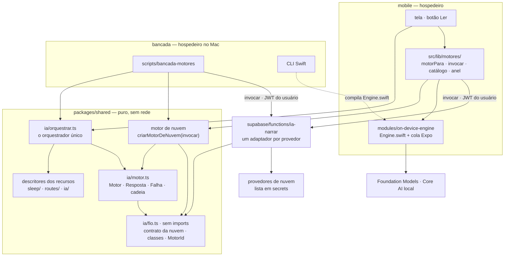
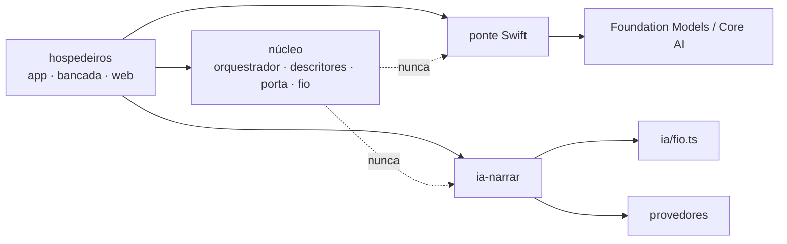

# Architecture Spine — Os motores do Orbe

> Os `AD-n` abaixo são **locais desta espinha** e colidem de propósito com os da espinha de
> iniciativa; toda referência à espinha pai vem marcada **herdada**, e à da revista, **da revista**.
> As catorze ADs foram aprovadas pelo dono em 10/09/2026 (`[ADOPTED]`): as AD-1 a AD-11 na
> conversa, e as AD-12 a AD-14, com as Rules apertadas pelo portão de revisão do mesmo dia, depois
> da leitura dele. O registro durável está nas ADRs 0047 a 0049.

## Design Paradigm

**Núcleo puro com porta de motor injetada e orquestrador único.** É o ports & adapters herdado com
uma porta só entre o domínio e qualquer modelo, `Motor`, e um só lugar que percorre a sequência
pedido → motor → interpretação → conferência → frase: o orquestrador, em `ia/`. Cada recurso declara
o seu caminho como descritor puro; cada hospedeiro (o iPhone, a bancada no Mac, a web quando entrar)
entrega ao orquestrador os motores que tem.

São **duas costuras em duas altitudes**, e só duas: a porta TypeScript escolhe o **tipo** de motor
(sem modelo, aparelho, nuvem); a linha `model:` do `LanguageModelSession`, dentro da ponte Swift,
escolhe os **pesos locais**.



Proibido: o núcleo importar SDK, fazer rede ou nomear fornecedor de modelo; um hospedeiro percorrer a
sequência por fora do orquestrador; qualquer arquivo chamar a `ia-narrar` ou importar a ponte fora do
ponto de injeção do seu hospedeiro; a ponte conhecer um recurso ou instanciar modelo de servidor; o
recuo aumentar a exposição ou trocar de destinatário.

## Inherited Invariants

| Inherited | From parent | Binds here |
| --- | --- | --- |
| AD-1 / AD-2 herdadas — fronteira pelo conjunto de imports; arquivo misto é partido | architecture-Orbe-2026-08-17 | descritores, orquestrador, porta, classes, cadeia e o motor de nuvem são puros e moram no núcleo; o que toca rede, Swift ou AsyncStorage fica no hospedeiro. `lib/edicao-ia.ts` e `services/route-name.ts` são mistos e partem na 1.10 e na F4 |
| AD-3 herdada — dono único do vocabulário | architecture-Orbe-2026-08-17 | `MotorId`, `RecursoId`, `CLASSES_DE_FALHA`, o caso da Saúde e a lista de termos proibidos nascem com um dono só. Hoje `ia/verificar.ts` tem apenas `CAUSA`, privada; a F0 cria a lista completa ali (AD-6) |
| AD-6 herdada — edge function só para segredo | architecture-Orbe-2026-08-17 | a `ia-narrar` segue burra (ADR 0042): lê o contrato de `ia/fio.ts`, classifica a falha e guarda a lista |
| AD-7 herdada — guarda mecânica, barreira × catraca | architecture-Orbe-2026-08-17 | as guardas da AD-10 local entram em `architecture.test.ts`; as que têm passivo nascem catraca |
| AD-8 herdada — instância Supabase única | architecture-Orbe-2026-08-17 | a bancada lê produção e não importa escritor de `data/`; nenhum dado de saúde é versionado (AD-11) |
| AD-11 herdada — ADR é imutável | architecture-Orbe-2026-08-17 | tudo o que esta espinha supera ou ratifica numa ADR aceita está nomeado nesta tabela e vira ADR nova (0047 em diante) |
| AD-12 herdada — estado é do app | architecture-Orbe-2026-08-17 | a preferência de motor é estado do hospedeiro; formato e resolução são do núcleo |
| AD-14 herdada — resolução isolada | architecture-Orbe-2026-08-17 | a ponte é módulo local sem dependência JS nova; nenhum SDK de modelo entra em `package.json` |
| AD-17 herdada — o device é fronteira nomeada | architecture-Orbe-2026-08-17 | a ponte só se prova no aparelho e na bancada; verde no CI nunca quer dizer motor funcionando |
| ADR 0040 | docs/decisions | inv. 1 lida como a ADR 0042 a leu: o núcleo conhece a porta e as classes, não o fornecedor. Inv. 2 e 3 intactas. Inv. 4: o período (a), "provedor e modelo vêm de configuração", é superado pela AD-9; o período (b), a assinatura de toda edição gravada, fica intacto |
| ADR 0041 | docs/decisions | ratificada: o nome de rota é o regime **molde** da AD-6; recusar é resultado válido (AD-12); "tenta no próximo tick" é o gatilho do recurso, não retry da porta |
| ADR 0042 | docs/decisions | ratificada: orquestração no aparelho e chamador injetado (AD-1, AD-2); o gatilho "ao abrir o detalhe, uma vez por pedalada" (§4) é o gatilho por entidade da Convenção |
| AD-12, AD-14 e AD-15 da revista | architecture-Orbe-revista-2026-09-08 | o TS da bancada vive no hospedeiro de scripts; a nuvem entra com JWT de usuário, nunca chave de serviço; a premissa "não há OTA" da AD-15 dela é desmentida por `app.base.json` (`updates.enabled`, `runtimeVersion` fixo) — corrigida no correct-course de 10/09 ([proposta](../../sprint-change-proposal-2026-09-10.md)) |
| AD-13 da revista | architecture-Orbe-revista-2026-09-08 | apertada pela AD-13 local: a sequência da impressão é cliente do orquestrador. Mudou o escopo da story 1.10 no correct-course de 10/09 |

## Invariants & Rules



O núcleo não depende de nada abaixo da porta; a edge function depende só do `ia/fio.ts`, que não
importa nada; os hospedeiros dependem do núcleo e das implementações.

### AD-1 — Duas costuras, nenhuma camada nova [ADOPTED]

- **Binds:** todo recurso que fala com modelo; `ia/motor.ts`; os pontos de injeção de cada hospedeiro; `mobile/modules/on-device-engine/`
- **Prevents:** três recursos com três contratos de chamada; uma terceira costura (Vercel AI SDK, LangChain e afins) competindo com a porta; falha atravessando a porta de dois jeitos
- **Rule:** a única porta entre o núcleo e um modelo é o tipo `Motor` em `ia/motor.ts`: uma função de `Pedido` para `Promise<Resposta | Falha>` que **nunca rejeita** — falha é valor, com classe (AD-4). `ChamadorDeModelo` vira apelido declarado no próprio `ia/motor.ts` e morre na F4; `Motor` só se importa de `ia/motor`, e reexportá-lo com outro nome é proibido. A porta escolhe o tipo de motor; a linha `model:` da ponte escolhe os pesos locais (AD-3). Nenhum SDK de modelo em JavaScript e nenhuma hierarquia de provedor acima da porta.

### AD-2 — O recurso é dono do caminho; só o orquestrador o percorre [ADOPTED]

- **Binds:** saude-do-sono, retrospectiva, nome-de-rota e todo recurso futuro; `ia/orquestrar.ts`; todos os hospedeiros
- **Prevents:** a próxima tela montar prompt ou conferir por conta própria; recuo e registro de falha com dois donos (orquestrador e porta); um recurso sem piso que some quando o motor falta
- **Rule:** cada recurso declara no núcleo, junto do seu domínio, um descritor registrado no catálogo de recursos de `ia/` — é lá que `RecursoId` tem dono, e o seletor nunca lista recurso à mão. O descritor declara: a montagem da entrada como função pura (a tela e a bancada chamam a mesma); `montarPedido(fatos)`, que devolve `Pedido` ou nulo — nulo quer dizer "não gaste chamada"; a interpretação da resposta; a conferência; a montagem da frase; `semModelo(fatos)`, obrigatório pelo tipo, que devolve frase ou ausência com motivo; a saída (`texto` ou `esquema`); o regime de números (AD-6); a amostragem; `regimeMaximo` (AD-5); a cadeia padrão; se grava e se recusa é resultado (AD-12); e as ferramentas, quando houver — recuperação nunca entra na função de fatos: filtro é SQL, semelhança é ferramenta, e só a ponte instancia ferramentas. O orquestrador único de `ia/orquestrar.ts` é o único que percorre cadeia: `ler(descritor, fatos, { modo, cadeia, motorPara, registrar, agora })`, com `motorPara` e `registrar` fornecidos pelo hospedeiro. O ponto de injeção entrega um motor por id e nunca repete, recua nem decide permanência. `sem-modelo` não é `Motor`: é o passo terminal do orquestrador. Há dois modos: `produto` (cadeia resolvida; a AD-5 vale) e `medicao` (exatamente um motor, sem recuo e sem piso; o resultado é a tentativa com a classe) — só a bancada e a tela de desenvolvimento usam `medicao`. Exceção que escape de um motor é defeito: vai ao anel com a pilha e cai no piso, nunca vira `transitoria`. Fora do núcleo, importam-se descritores e orquestrador, não as peças.

### AD-3 — A ponte do aparelho é Swift nosso, sem estado, sem domínio e só com pesos locais [ADOPTED]

- **Binds:** `mobile/modules/on-device-engine/`; a CLI da bancada; a transição do Xcode 27 e a F5
- **Prevents:** sessão compartilhada entre recursos; build quebrado por símbolo de SDK mais novo; a CLI e o app compilando Swift diferente; modelo de servidor entrando pela porta do aparelho; o JS da porta chegando por OTA a um binário sem a ponte
- **Rule:** módulo Expo local em dois arquivos em `mobile/modules/on-device-engine/ios/`. `Engine.swift` importa só `Foundation` e `FoundationModels` (e o módulo do Core AI na F5), recebe o pedido como a string JSON canônica da AD-11, decodificada por um único `Codable`, e devolve `Resposta` ou `Falha` em JSON; a tabela erro → classe (AD-4) e a conversão de esquema moram nele. O arquivo de cola do Expo não tem `catch`, literal de classe nem lógica, e é carregado pela porta com `requireOptionalNativeModule`: ausência é `indisponivel`, nunca exceção no import. Uma sessão nova por pedido até existir recurso de conversa. Guardas: `#available(iOS 26, macOS 26, *)` em execução, sempre com os dois sistemas; `#available(iOS 26.4, macOS 26.4, *)` para `tokenCount`; símbolo novo dentro de `FoundationModels` (os tipos do Xcode 27) atrás de `#if compiler(>=6.4)`; `#if canImport` só para módulo novo inteiro; `@unknown default` em todo `switch` sobre enum da Apple. A janela é lida de `contextSize` em execução, nunca constante. A ponte só instancia pesos que rodam no aparelho; modelo de servidor — Private Cloud Compute ou pacote de provedor — nunca entra nela: se vier, é `nuvem:`, com tabela de regime e lista do servidor (AD-9). O guardrail é intenção do pedido, mapeada em `SystemLanguageModel(useCase:guardrails:)`; o modo permissivo só existe com `saida: texto`, e o tipo impede o par inválido. É o único lugar do aparelho que nomeia Apple ou Core AI. O build que embarca a ponte sobe `runtimeVersion`, e nenhum update com código da porta vai para runtime anterior.

### AD-4 — Falha tem classe do Orbe, com critério, e a classe decide [ADOPTED]

- **Binds:** a ponte, o adaptador da nuvem e a `ia-narrar`, o motor de nuvem do núcleo, o orquestrador
- **Prevents:** retry inútil em falha irrecuperável; duas pontas classificando o mesmo erro de jeitos diferentes; nomes de erro da Apple — que mudam no Xcode 27 — e códigos HTTP chegando a uma decisão; erro não mapeado sumindo
- **Rule:** `CLASSES_DE_FALHA` tem dono em `ia/fio.ts`, e cada classe tem critério. `indisponivel`: o motor não atende nenhum pedido agora e outro pode (não elegível, Apple Intelligence desligada, modelo não pronto, pesos ausentes, fora da lista, sem rede, sem crédito ou chave). `capacidade`: atende, mas não este pedido (idioma, esquema, guia, guardrail que não honra). `janela`: o pedido não cabe no contexto. `guarda`: o guardrail bloqueou. `recusa-do-modelo`: o modelo recusou — na geração guiada, pelo erro; no texto, detectada pela conferência (AD-6). `saida-invalida`: a resposta não se lê (ilegível, truncada, fora do esquema, motivo de parada que não seja conclusão). `transitoria`: o mesmo pedido no mesmo motor pode dar certo depois (timeout, limite de taxa, 5xx, concorrência). Destinos: `indisponivel` e `capacidade` recuam na cadeia. `guarda`, `recusa-do-modelo`, `saida-invalida` e a conferência reprovada — que não é classe de motor, e sim o resultado `reprovada` na trilha — são permanentes para aquele pedido: nunca se repetem e caem no piso. `janela` repete uma vez com o pedido curto do recurso; sem ele, é permanente. `transitoria` cai no piso e não se repete na mesma execução. Erro não reconhecido e `@unknown default` viram `transitoria` e vão ao anel com o nome cru. A tradução de cada borda é uma tabela ao lado dela, com teste. `detalhe` pode levar texto do fornecedor para diagnóstico e só a tela de desenvolvimento o mostra; nenhuma decisão o lê.

### AD-5 — O recuo nunca aumenta a exposição nem troca de destinatário [ADOPTED]

- **Binds:** a resolução de preferência e de cadeia no núcleo; os seletores; toda cadeia padrão
- **Prevents:** dado de saúde saindo do telefone porque um motor local falhou; dado indo a um provedor de nuvem que ninguém escolheu (a alternativa que a ADR 0040 rejeitou); preferência corrompida ou renomeada virando nuvem por padrão
- **Rule:** a exposição se ordena assim: sem modelo, aparelho, nuvem — e, na nuvem, cada provedor é um destinatário próprio (regime por provedor, ADR 0040). Uma cadeia só recua para motor de exposição igual ou menor e, na nuvem, do mesmo provedor; provedor diferente só entra por preferência explícita, motor a motor. Em modo `produto`, `sem-modelo` é sempre o último elo. Cada recurso declara `regimeMaximo`: a resolução recusa preferência acima dele, e o seletor não a oferece. Preferência ilegível degrada dentro do próprio regime: `aparelho:` com pesos desconhecidos resolve para a cadeia do recurso filtrada a aparelho ou menos; id que nem se deixa ler resolve para `sem-modelo`; nunca para um padrão de exposição maior que a da preferência gravada. `Cadeia` é tipo marcado que só a função do núcleo constrói. Um teste de propriedade sobre preferência × padrão × catálogo cobra que a exposição não cresce, o provedor não muda e `sem-modelo` fecha a cadeia. A trilha diz quem foi tentado e com que classe, e a tela diz quem escreveu e por que o escolhido não escreveu.

### AD-6 — O motor escreve palavras; o código escreve números [ADOPTED]

- **Binds:** a conferência de cada recurso; `ia/interpolar.ts`; `ia/verificar.ts`; `format/numero.ts`
- **Prevents:** número errado com cara de número certo; recusa em texto livre passando por leitura; cada recurso com a sua sintaxe de marcador e a sua lista de termo proibido
- **Rule:** todo recurso declara um de três regimes de números, e regime não declarado não compila. **Interpolado** (padrão de recurso novo; obrigatório na Saúde do sono): a saída do motor não tem algarismo; valor só entra por marcador de um conjunto declarado pelo recurso, com sintaxe e substituição de dono único em `ia/interpolar.ts`; a conferência reprova dígito e marcador fora do conjunto e **exige a presença** das dimensões do caso, pelo nome ou pelo marcador — a ausência é `recusa-do-modelo`, classificada pelo orquestrador. **Copiado e conferido** (o da retrospectiva): o motor escreve números e a conferência exige que cada um exista no pacote. **Molde** (o do nome de rota, ADR 0041): o motor devolve campos por esquema, a frase sai do molde e a conferência é de pertinência — todo lugar citado foi enviado. Os termos proibidos têm uma lista só, `VOCABULARIO_PROIBIDO`, criada na F0 em `ia/verificar.ts` e exportada, com subconjuntos nomeados (causa — a `CAUSA` de hoje —, conselho, elogio, placar, tendência e meta, comparação com outras pessoas); cada recurso compõe os subconjuntos que valem para ele, e nenhum outro arquivo declara lista de termo proibido. Todo fato interpolado sai formatado em pt-BR por `format/numero.ts`, para onde a F0 move `formatarNumero`.

### AD-7 — Na Saúde do sono, o caso é do código [ADOPTED]

- **Binds:** a leitura da Saúde do sono em `sleep/`; a sonda de fidelidade da bancada
- **Prevents:** o motor comparando notas, ou seja, calculando; dois classificadores escolhendo casos diferentes para a mesma janela; a frase afirmar "a que puxa para baixo" nas 85% de semanas em que ela não existe
- **Rule:** uma função pura em `sleep/` põe cada `SleepScore` em exatamente um caso, avaliado nesta precedência: `sem-contagem` (`scored` falso, noite ou período: diz a cobertura quando houver, nunca "conjunto") → `medidas-insuficientes` (menos de duas dimensões medidas: não há o que comparar) → `tudo-no-maximo` (sem elogio) → `todas-iguais` (todas as medidas no mesmo ponto abaixo de 2) → `uma` (exatamente uma no mínimo) → `duas` (exatamente duas no mínimo e alguma acima) → `fora-do-empate` (três ou mais no mínimo e alguma acima: nomeia as de fora). O caso carrega quantas dimensões foram medidas, e a frase usa essa contagem, nunca o número cinco fixo. Dimensão não medida sai do caso (regra 4 da ADR 0036). O motor recebe o caso e as dimensões a nomear, nunca as notas para decidir. Um teste enumera todas as combinações de nota × presença nas cinco dimensões e confere que cada uma cai em exatamente um caso. Pedir ao motor que escolha a dimensão existe só em modo `medicao`, por esquema de opções fechadas. A Saúde do sono declara amostragem gulosa. Por ser leitura efêmera, sob pedido e sem gravação, ela lê período em curso: a §3 do spec `ia-analitica` vale para recurso que grava (decisão do dono, 10/09).

### AD-8 — A escolha do motor é de cada aparelho, por recurso [ADOPTED]

- **Binds:** os pontos de injeção, `/configuracoes/motores`, a bancada, a web quando usar motores; `ia/fio.ts`
- **Prevents:** a web receber um motor que não roda; migration por motor novo; ids escritos de três jeitos (núcleo, ponte, servidor); o catálogo esconder o motor indisponível e a tela não saber dizer por quê
- **Rule:** a preferência é um mapa `RecursoId` → `MotorId` guardado localmente, por um módulo só, dono da chave, com fila de escrita no molde de `sync-breadcrumbs` — AsyncStorage no iPhone, `localStorage` na web, argumento de invocação na bancada. A `user_preferences` não é tocada. `MotorId` é identidade estável de escolha; a assinatura é a identidade observada de quem respondeu, e nada compara uma com a outra. A gramática tem dono em `ia/fio.ts` (`lerMotorId`, `formatarMotorId`): o tipo vai até o primeiro `:`, o provedor até o primeiro `/`, e o resto é literal. Há duas variantes simbólicas reservadas: `aparelho:sistema` (o modelo que o sistema fornece, em qualquer versão) e `nuvem:padrao` (corpo sem motor: o servidor escolhe). Cadeias padrão declaradas no núcleo usam só `sem-modelo` e essas duas. A ponte publica o catálogo com esses ids exatos. O catálogo lista todo motor conhecido do hospedeiro com estado disponível ou indisponível com motivo, e a resolução nunca descarta a preferência: motor indisponível entra na trilha como tentativa sintética com classe `indisponivel`. `nuvem:padrao` está no catálogo sempre que há rede, com ou sem lista; falhar ao ler a lista remove só as variantes nomeadas, e o app pode guardar a última lista lida como cache com instante.

### AD-9 — A lista de motores de nuvem tem um dono: o servidor [ADOPTED]

- **Binds:** `supabase/functions/ia-narrar`, `_shared/ia/narrador.ts`, os `secrets`, o catálogo de nuvem dos hospedeiros
- **Prevents:** a lista do app e a do servidor divergirem; o cliente escolher modelo não autorizado; trocar o modelo padrão por `secrets` sem medir; provedor entrando sem regime conhecido
- **Rule:** supera o período (a) da invariante 4 da ADR 0040: provedor e modelo passam a vir de uma lista em `secrets`, escrita em `MotorId` completo, e `AI_PROVIDER` e `AI_MODEL` continuam sendo o padrão (`nuvem:padrao`). A `ia-narrar` aceita `motor` opcional no corpo: na lista, é usado; ausente, vale o padrão; fora da lista, falha com classe `indisponivel`. A function expõe a lista para leitura, o app a lê do servidor, e o deploy que a expõe vem antes do build que a lê. Um provedor só entra na lista com a sua tabela de regime versionada em `docs/` (tier, o que pode ser enviado, retenção, DPA, uso para treino, o que faz com `guardrails`). Modelo novo de provedor existente é configuração; provedor novo é um adaptador em `_shared/ia/narrador.ts`. Cada entrada da lista carrega os recursos para os quais passou na bancada, escritos só a partir de um relatório dela; os recursos existentes entram aprovados para o modelo em produção hoje. `nuvem:padrao` só resolve para um recurso se o padrão corrente estiver aprovado para ele; senão é `indisponivel`, com o motivo "não medido". A resposta segue assinando o modelo que de fato atendeu. A function nunca registra `sistema` nem `usuario` em log; registra motor, classe, status e tokens. Corpo sem `motor` se comporta como hoje.

### AD-10 — Uma porta por hospedeiro, e as barreiras acham o inquilino sozinhas [ADOPTED]

- **Binds:** os pontos de injeção, `packages/shared/src/architecture.test.ts`, `Engine.swift`, `supabase/functions/`
- **Prevents:** a terceira cópia do cliente da `ia-narrar`, dentro ou fora do mobile; um recurso novo fora da lista manual da barreira; a ponte e a function emitindo classe que o núcleo não conhece
- **Rule:** sete guardas mecânicas. (1) O literal `'ia-narrar'` e o import de `on-device-engine` só aparecem no ponto de injeção declarado de cada hospedeiro — `mobile/src/lib/motores/`, `web/src/app/core/motores/`, um por script em `scripts/` —, e a guarda varre `mobile/src`, `web/src` e `scripts/`; nasce catraca em 2 (`lib/edicao-ia.ts`, `services/route-name.ts`) e vira barreira na F4. (2) A barreira "o núcleo que fala com modelo não conhece rede, SDK nem fornecedor" tem alvo derivado do código: o fecho transitivo, por import relativo, de todo arquivo de `packages/shared/src` (fora de teste) que importa `ia/motor`, além de `ia/` e `routes/`; a lista proibida ganha `coreai`, `qwen`, `llama`, `mlx`, `gemma`, `foundationmodels` e `privatecloudcompute`, e `apple` fica fora por ser vocabulário de domínio no sono. (3) A barreira acha em `Engine.swift` o `enum ClasseDeFalha: String` com valores brutos explícitos — e falha se não achar — e exige igualdade de conjunto com `CLASSES_DE_FALHA`; `supabase/functions/` não declara literal de classe fora do que importa de `ia/fio.ts`. (4) `Engine.swift` só importa módulos da lista permitida, nunca `ExpoModulesCore` nem modelo de servidor. (5) Os testes de propriedade da AD-5 e de partição da AD-7. (6) `CONCLUSAO` (AD-12) é igual ao `CHECK` de `edicoes_ia.motivo_de_parada`, no molde de `ID_COLUMNS`, e o literal `'STOP'` só aparece no adaptador do Google. (7) Fora de `packages/shared`, só descritores e o orquestrador são importados do núcleo de IA, nunca as peças de um recurso; nasce catraca no número atual (`lib/edicao-ia.ts`) e vira barreira na 1.10.

### AD-11 — A bancada roda o mesmo Swift e o mesmo pedido que o app [ADOPTED]

- **Binds:** a bancada (F1), a tela de desenvolvimento, todo recurso que queira motor de modelo como padrão
- **Prevents:** medir um caminho e publicar outro; um portão aprovado para um modelo que o sistema já trocou; dois relatórios incomparáveis
- **Rule:** pedido idêntico é pedido com o mesmo hash. O núcleo é dono de `serializarPedido` (JSON canônico: chaves ordenadas, nenhum campo indefinido, com a versão do descritor) e de `hashDoPedido`, e a entrada do recurso é função pura — na Saúde do sono, `entradaDaSaude(noites, notas, { range, offset, hoje })`, com as janelas de noite e de nota explícitas —, chamada pela tela e pela bancada. A bancada executa o orquestrador em modo `medicao` com o motor injetado e acrescenta só a sonda e o relatório. A CLI compila `Engine.swift` sem cópia, e se a F1 chegar antes da F2 é ela quem cria `Engine.swift` no caminho do módulo. O TS da bancada vive no hospedeiro de scripts da AD-12 da revista — workspace declarado, sob as barreiras —, e se a bancada chegar antes da story 2.1 é ela quem cria esse workspace. A nuvem entra pela `ia-narrar` com JWT de usuário, pelo `invocar` injetado no motor de nuvem do núcleo (AD-14). Relatório e portão são chaveados por recurso, `MotorId` e build do sistema de cada lado; Mac e iPhone medem no mesmo major.minor, e resultados de versões diferentes nunca se somam. A linha de base da primeira medição é o iOS e o macOS 27 (decisão do dono, 10/09): a F1 mede com os dois no 27, e o app segue compilando com o Xcode 26.6, porque o modelo vem do sistema. A CLI e o build de entrega usam o mesmo Xcode maior; se o Xcode 26.6 não abrir no macOS 27, a F1 para e volta ao dono. A amostra de 20 pedidos no iPhone compara por hash e roda de novo sempre que o Mac ou o iPhone muda de versão maior. Nenhum dado de saúde de produção é versionado: a bancada versiona só o manifesto (as janelas e o hash do export), e um relatório só se compara com outro do mesmo manifesto. Um recurso só ganha motor de modelo como padrão depois de passar pela bancada, com limiar fixado pelo dono após o primeiro relatório.

### AD-12 — O resultado diz de onde veio, e só resposta de motor grava [ADOPTED]

- **Binds:** o orquestrador; os recursos que gravam (retrospectiva, nome-de-rota); as portas de gravação; `ia/motor.ts`
- **Prevents:** uma indisponibilidade passageira virar estado permanente no banco (rota marcada como visitada para sempre, edição impressa com a frase do piso); a grafia de conclusão de um fornecedor presa em código e em `CHECK`
- **Rule:** o orquestrador devolve resultado discriminado: `origem: 'motor'` (texto, a `Resposta` inteira com assinatura e tokens, a trilha e os problemas da conferência) ou `origem: 'piso'` (frase ou ausência, `causa` e a trilha); `causa` é a classe que derrubou o último motor, `reprovada`, `mudo` (pedido nulo) ou `preferencia` (a cadeia era só `sem-modelo`). O resultado de `medicao` é de outro tipo. Um recurso que grava declara os tipos de motor que admite, como a assinatura vira colunas e se recusa é resultado; o catálogo e a cadeia nunca lhe oferecem motor que ele não admite. A porta de gravação aceita um tipo que só `origem: 'motor'` produz — e, se o recurso declarar recusa como resultado, também as causas permanentes (`guarda`, `recusa-do-modelo`, `saida-invalida`, `reprovada`). Piso causado por `indisponivel`, `capacidade`, `transitoria` ou `janela` nunca grava nada, nem recusa, nem marca de visitado. A `Resposta` não carrega motivo de parada cru: a borda o traduz — conclusão vira `Resposta`, o resto vira `Falha` com classe `saida-invalida` e o motivo cru no detalhe. O Orbe tem a constante `CONCLUSAO`, de dono em `ia/motor.ts` (valor `'STOP'`, sem migration), e é ela que `upsertEdicao` grava; nenhum consumidor compara motivo de parada. A assinatura carrega a versão do descritor do recurso.

### AD-13 — A impressão da revista é cliente do orquestrador [ADOPTED]

- **Binds:** a story 1.10 (`ia/imprimir.ts`), a F0, o descritor da retrospectiva
- **Prevents:** duas sequências pedido → motor → conferência em `ia/`, com duas políticas de falha; dois tipos de porta; um orquestrador que chama o motor com prompt vazio
- **Rule:** a sequência da impressão não chama `Motor`: chama o orquestrador uma vez por caderno, com o descritor da retrospectiva — regime copiado e conferido, grava, piso = ausência, recusa não é resultado, e `montarPedido` nulo para caderno mudo. O descritor nasce na F0, junto do da Saúde do sono. Quem chegar primeiro entre a F0 e a 1.10 cria `ia/motor.ts`, `ia/orquestrar.ts` e `ia/fio.ts` exatamente como esta espinha fixa. A porta `ler` da revista, que lê do banco, passa a se chamar `buscar`: "Ler" é o botão, e a interpretação da resposta é "interpretar" (AD-3 herdada). "Mostrar é progressivo, gravar é atômico" continua sendo da revista.

### AD-14 — O fio da nuvem é do núcleo [ADOPTED]

- **Binds:** `ia/fio.ts`; `supabase/functions/ia-narrar` e `_shared/ia/narrador.ts`; o `invocar` de cada hospedeiro
- **Prevents:** quatro clientes (app, web, bancada, backfill) lendo o erro da `ia-narrar` cada um do seu jeito — hoje o ramo que lê o corpo de erro é código morto nas duas cópias, porque `functions.invoke` devolve erro antes do corpo em todo não-2xx; a function emitindo classe que o núcleo não conhece; o bloqueio de segurança do provedor chegando como "texto vazio"; três dialetos de esquema
- **Rule:** o contrato da `ia-narrar` — o corpo do pedido (o `Pedido` mais o `motor`), o corpo da resposta, o envelope de falha com classe e um status fixado por classe, `CLASSES_DE_FALHA`, `lerMotorId` e `formatarMotorId` — mora em `packages/shared/src/ia/fio.ts`, **sem imports**, importado pela function por caminho relativo e coberto pela barreira "módulo do núcleo importado pelo Deno continua sem imports". A function nunca devolve falha sem classe. O motor de nuvem é um só e mora no núcleo: `criarMotorDeNuvem(invocar)`, com o transporte injetado e normalizado — status e corpo, ou falta de rede —; cada hospedeiro só injeta `invocar`. O esquema é o subconjunto fechado `Esquema` do núcleo — objeto com propriedades obrigatórias ou opcionais, string com `enum`, inteiro com limites, booleano, lista com mínimo e máximo; sem `null`, `$ref`, `oneOf` nem `format` —, com validador; ausência é propriedade opcional. O adaptador traduz o esquema para o formato do provedor, e o `json?` de hoje passa a ser derivado da saída.

## Consistency Conventions

| Concern | Convention |
| --- | --- |
| Vocabulário | motor, recurso, pedido, resposta, falha, assinatura, classe de falha, cadeia de recuo, caso; "exposição" na AD-5, "regime de números" na AD-6, "interpretar" para a leitura da resposta; o botão da tela é "Ler". O módulo nativo tem nome em inglês, `on-device-engine`, e a API da ponte é em inglês — exceto as classes de falha e os `MotorId`, que atravessam como as strings do núcleo |
| Pedido | sistema, usuario, saida (`texto` ou `esquema` no subconjunto `Esquema`), guardrails e amostragem (`gulosa` ou `padrao`) — intenção, não formato de fio, no princípio do `json?` da ADR 0042. No aparelho, pedido de texto não fixa teto de saída, porque o corte é silencioso; o tamanho é cobrado na conferência |
| Resposta | só existe para geração concluída: texto, assinatura e tokens quando houver (no aparelho, `tokenCount` a partir do 26.4 ou `usage` no 27) |
| Assinatura | tipo, provedor, modelo, plataforma, build do sistema (no aparelho), versão do descritor e instante, em toda resposta. No aparelho, o modelo é o que o sistema fornece; na nuvem, o que o provedor reportou |
| Concorrência | é propriedade do motor: o catálogo declara quantos pedidos cada um aceita em paralelo (aparelho: um) e o ponto de injeção serializa por motor. Voo único por recurso e hash do pedido: um segundo toque com o mesmo hash se junta ao primeiro, e resultado cujo hash não é o do pedido corrente da tela é descartado. A ponte não cancela |
| Quando se chama um motor | o recurso declara o seu gatilho. Leitura efêmera: só por ação explícita, do usuário ou da bancada, nunca ao abrir a tela. Recurso que grava uma vez por entidade: pode disparar por evento, no máximo uma vez por entidade, protegido pela marca gravada — é o nome de rota ao abrir o detalhe da pedalada (ADR 0042 §4), cujo "próximo tick" é o próprio gatilho, não retry da porta |
| Registro local (anel) | no aparelho, no molde de `sync-breadcrumbs`: a trilha de toda execução (classe de cada tentativa) e o pedido completo só nas falhas permanentes, defeitos e erros não mapeados. Teto por tamanho; o conteúdo nunca sai do aparelho e nunca vai ao banco. O resultado de domínio de um recurso que grava continua onde a ADR dele manda (`route_name_meta`, `edicoes_ia`) |
| Dado de produção na bancada | leitura só, sem escritor de `data/`; export sob demanda para diretório ignorado pelo git; versiona-se o manifesto, nunca o dado de saúde |
| OTA | o build que embarca ou muda a ponte sobe `runtimeVersion`; update com código da porta nunca vai para runtime anterior |

## Stack

| Name | Version |
| --- | --- |
| Foundation Models (modelo do sistema) | iOS 26.0+; `contextSize` 26.0+ (back-deploy, 4.096 fixo até o 26.3); `tokenCount` 26.4+; `usage` iOS 27 |
| iOS e macOS 27 | públicos em 14/09/2026, com modelo novo (`contextSize` 8.192 na amostra da WWDC26) |
| Xcode 27 | RC desde 09/09/2026, Swift 6.4 — só na F5 e na migração de erros |
| Core AI (`CoreAILanguageModel`, pacote `apple/coreai-models`) | exige iOS e macOS 27 como alvo mínimo — F5 |
| Xcode local e imagem EAS da SDK 57 | 26.6 (SDK iOS 26.5, Swift 6.3) |
| Alvo mínimo do app | iOS 16.4 — padrão do template da SDK 57, não fixado no app config |
| Expo SDK | 57.0.20 (lock) · expo-modules-core 57.0.16 |
| React Native | 0.86.3 |
| expo-updates | ligado · `runtimeVersion` 1.0.5 |
| macOS da bancada | 26.6.2, Apple Silicon, Apple Intelligence ativo |
| Supabase Edge Functions (Deno), `ia-narrar` | em produção desde 06/09/2026 · sem SDK de provedor |
| `@react-native-ai/apple` | 0.12.0 — avaliado e rejeitado |

## Structural Seed

```text
packages/shared/src/
  ia/motor.ts          # AD-1/5/12 — Motor, Pedido, Resposta, Falha, Cadeia, CONCLUSAO, resolução
  ia/orquestrar.ts     # AD-2 — o orquestrador único, modos produto e medicao
  ia/fio.ts            # AD-4/8/14 — sem imports: contrato da nuvem, CLASSES_DE_FALHA, MotorId, Esquema
  ia/interpolar.ts     # AD-6 — sintaxe e substituição de marcador
  ia/verificar.ts      # AD-6 — VOCABULARIO_PROIBIDO, exportado
  ia/                  # catálogo de recursos, descritor da retrospectiva, criarMotorDeNuvem
  format/numero.ts     # AD-6 — formatarNumero, movido de ia/prompt.ts
  sleep/               # AD-7 — entradaDaSaude, caso, fatos, descritor da Saúde do sono
  routes/nomear.ts     # descritor do nome de rota na F4; ChamadorDeModelo morre ali
mobile/
  modules/on-device-engine/ios/Engine.swift                # AD-3 — sessão, erro → classe, esquema
  modules/on-device-engine/ios/OnDeviceEngineModule.swift  # AD-3 — cola do Expo, sem lógica
  src/lib/motores/                                          # AD-10 — ponto de injeção: motorPara, invocar, catálogo, preferência, anel
  src/app/sono/saude.tsx                                    # o botão Ler (F2)
  src/app/configuracoes/motores.tsx                         # o seletor por recurso (F2)
supabase/functions/
  ia-narrar/index.ts          # AD-9/14 — lê ia/fio.ts, aceita o motor da lista, a expõe, classifica
  _shared/ia/narrador.ts      # um adaptador por provedor; 'STOP' só aqui
scripts/bancada-motores/      # AD-11 — pedidos, medição, relatório; CLI Swift sobre Engine.swift
docs/decisions/0047..0049     # as ADRs desta espinha
```

| Peça | Onde roda | Como chega lá |
| --- | --- | --- |
| Núcleo de IA (TS) | iPhone (bundle JS), Mac (tsx) e, só `ia/fio.ts`, a edge function | build do app; pnpm na bancada; deploy da function |
| Ponte Swift | iPhone | `expo prebuild` + build nativo (EAS ou `xcodebuild` local) com `runtimeVersion` novo |
| CLI da bancada | Mac de desenvolvimento | `swift build` local, com o mesmo Xcode maior do build de entrega; nunca no CI |
| `ia-narrar` e a lista | Supabase, instância única | deploy manual pela CLI, antes do build que lê a lista; lista por `supabase secrets set` |
| Pesos do Core AI | iPhone | decisão da F5 |

## Capability → Architecture Map

| Capability / Area | Lives in | Governed by |
| --- | --- | --- |
| Leitura da Saúde do sono (F0–F2) | `sleep/`, `ia/`, o ponto de injeção do app, a ponte, o botão em `/sono/saude` | AD-2, AD-3, AD-6, AD-7, AD-12 |
| Escolha de motor por recurso | preferência local, `/configuracoes/motores`, resolução no núcleo | AD-5, AD-8 |
| Motores de nuvem (F3) | `ia/fio.ts`, `criarMotorDeNuvem`, `ia-narrar`, `narrador.ts`, `secrets` | AD-4, AD-9, AD-14 |
| Narração da retrospectiva (story 1.10) | `ia/imprimir.ts` como cliente do orquestrador | AD-12, AD-13 |
| Nome de rota (F4) | `routes/` com descritor em regime molde; `services/route-name.ts` pelo ponto de injeção | AD-1, AD-6, AD-10, AD-12 |
| Bancada (F1) | `scripts/bancada-motores`, CLI Swift sobre `Engine.swift` | AD-2 (medição), AD-11 |
| Core AI (F5) | a ponte, linha `model:` | AD-3, AD-4 |

## Deferred

| Item | Condição de revisita |
| --- | --- |
| Xcode 26.6 no macOS 27 (não verificado) | ao subir o Mac para o 27, antes da F1: se não abrir, a F1 para e volta ao dono — as saídas são build de entrega local com Xcode 27, se a SDK 57 compilar nele, ou a bancada pelo iPhone |
| Core AI | F5: exige alvo mínimo iOS 27, ou vendorizar `apple/coreai-models` (BSD-3), ou conformidade própria de `LanguageModel` sobre o framework; Xcode 27 fora da imagem EAS da SDK 57 (build local); memória por tamanho; pesos sem guardrail da Apple e se recurso sensível os admite |
| Ferramentas (Spotlight) | o primeiro recurso de perguntas; a regra já está na AD-2 |
| Sessão com estado | o recurso de conversa; até lá, uma sessão por pedido (AD-3) |
| Web | quando um recurso entrar na web: ponto de injeção próprio, catálogo sem modelo + nuvem, preferência em `localStorage` |
| Limiar do portão da bancada | depois do primeiro relatório, pelo dono |
| Retry automático de `transitoria` | só se o anel — que agora registra a trilha de toda execução — mostrar que vale |
| Avaliação pelas ferramentas da Apple (Evaluations, CLI `fm`, SDK Python) | se o Mac subir para o 27; a AD-11 exige o mesmo Swift, que elas não dão |
| Guardrail em recursos sensíveis (álcool, peso) | a bancada mede a taxa antes de qualquer recurso desses existir |
| Fixtures de rota com coordenadas reais já versionados (`routes/__fixtures__/`) | decisão do dono, fora desta espinha — a regra da AD-11 vale para dado de saúde |
