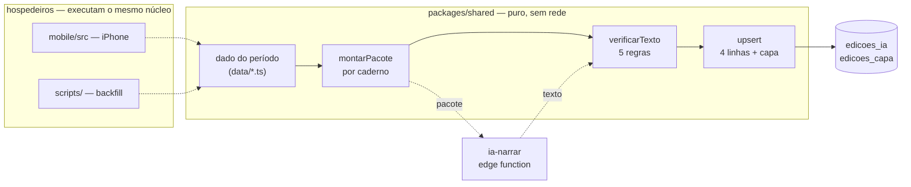
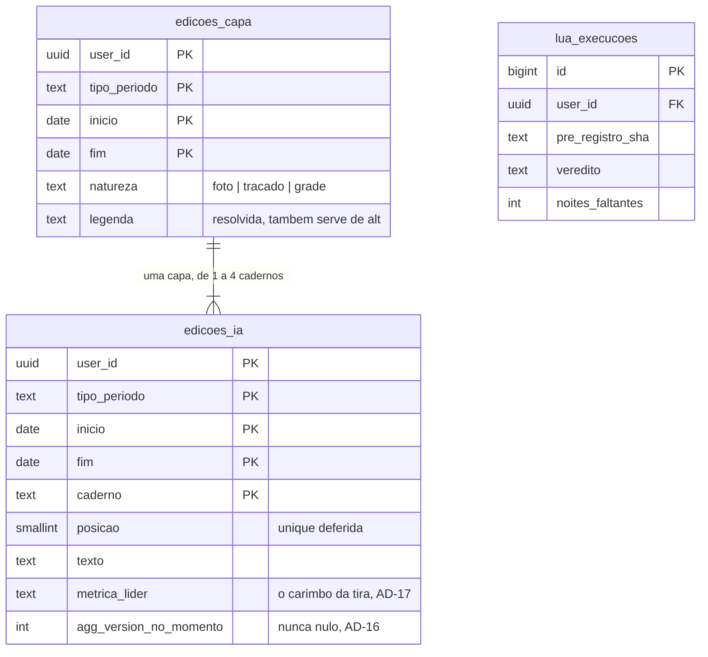

# Architecture Spine — A revista da Retrospectiva

> Esta espinha **não redecide o contrato**. `spec.md` e seus seis companions
> continuam sendo a lei do que construir; aqui ficam só as invariantes que a
> construção precisaria inventar, e que dois construtores inventariam diferente.
> Onde `mudancas-mecanicas.md` já decide — chave de `edicoes_ia`, mudanças do
> núcleo, o que sai do código, paginação do backfill — esta espinha **cita e não
> repete**.

## Design Paradigm

**Pipeline puro com portão de verificação, publicando registro imutável.** O dado
já gravado entra, sai um texto que só existe se passar pela conferência, e o que
foi publicado nunca é reescrito — muda por errata.

O pipeline tem quatro estágios e **três hospedeiros** que o executam igual. Só o
estágio de narração sai do processo; os outros três são função pura.



A página da lua **não passa por este pipeline**: ela é calculada sob protocolo,
não narrada, e por isso não assina modelo (AD-6).

## Inherited Invariants

Da espinha de iniciativa [`architecture-Orbe-2026-08-17`](../architecture-Orbe-2026-08-17/ARCHITECTURE-SPINE.md).
Ids originais, read-only, não renumerados. Nenhuma decisão abaixo as contradiz.

| Herdada | Vincula aqui |
| --- | --- |
| **AD-1 / AD-2** — fronteira pelo conjunto de imports | `ordenarCadernos`, a efeméride, o teste lunar e a extração da chamada são puros e sobem para o núcleo; foco de acessibilidade e rolagem ficam no adaptador (AD-9) |
| **AD-3** — dono único do vocabulário | `CadernoId` nasce com um dono só (AD-2 local); o instante das fases entra no dono que já existe, `astro/moon.ts` (AD-6) |
| **AD-4** — query em `data/`, client injetado | `edicoes_capa` e `lua_execucoes` ganham cada uma o seu módulo em `shared/src/data/`; o script de backfill constrói o próprio client (AD-12) |
| **AD-5** — banco como exceção nomeada | autoriza a saída por RPC do AD-4 local *se* a transação-por-requisição deixar de valer — por "colapsar round-trip", que é uma das duas razões que a AD-5 admite |
| **AD-7** — guarda mecânica no teste | as três barreiras novas (AD-7, AD-8, AD-12 locais) entram em `architecture.test.ts` / `theme.test.ts`, nunca em revisão de código |
| **AD-11** — ADR é imutável | a ADR 0045 **não se edita**: a emenda é ADR nova que a supersede em parte |
| **AD-12** — estado é do app | `retro_prefs` é resolvido no núcleo; quem grava é o store do app |
| **AD-13** — target de teste não é stub | a barreira do hash (AD-7) roda offline, senão seria verde por não executar |
| **AD-17** — o portão cobre os três workspaces | `onAccent` (AD-8) toca o núcleo e os dois apps: o portão inteiro |

## Invariants & Rules

> Os `AD-n` abaixo são **locais desta passagem**, e os números colidem de propósito
> com os da espinha de iniciativa. Toda referência à espinha pai vem marcada
> **"herdada"** — e a colisão é real onde mais importa: a AD-11 local é a chamada, a
> AD-11 **herdada** é a imutabilidade das ADRs.

### AD-1 — A revista é rota própria; a Retrospectiva é a porta

- **Binds:** CAP-8, CAP-9, CAP-10, CAP-13
- **Prevents:** os treze blocos da Retrospectiva serem absorvidos ou demitidos, a
  capa de 45vh disputar o topo com o seletor de período — e a superfície nova virar
  o lugar onde *"a revista nunca gera sozinha"* morre
- **Rule:** a edição vive em `/revista/[tipo]/[inicio]`, rota nova, onde não há
  seletor a expulsar. `/retrospectiva` **não perde nada** — seletor, os treze
  blocos (`RetroBlockId` tem treze ids; o `EXPERIENCE.md` diz doze) e o painel
  Diagramação ficam. O `EdicaoCard` dentro do bloco `lede` é a **única porta** para
  a primeira revista, e a parede de capas é irmã da rota, não filha dela: isso fecha
  o grafo circular que o `EXPERIENCE.md` deixou aberto.
  **A rota só lê.** Abrir `/revista/…` de um período fechado e não impresso mostra o
  convite de escrever e **não escreve**; a parede desenha **só as capas que existem**
  e nunca imprime para preencher buraco. Rota endereçável mais parede longa é
  exatamente a superfície onde uma geração preguiçosa passaria despercebida e
  custaria seis chamadas pagas por rolagem.
  O postal da semana é a mesma rota com `tipo=week`, e **não grava**: calcula na
  hora, e a prosa só existe se o dono mandar escrever e some ao sair.
  Período em curso e `all` **não têm rota de revista** — `periodoFechado` devolve
  `false` para `'all'` sempre, e o CHECK do banco o recusa; nesses dois casos os
  blocos são o conteúdo inteiro, e é por isso que eles não podem morrer.

### AD-2 — Caderno não é bloco, e tem vocabulário próprio

- **Binds:** CAP-1, CAP-2, CAP-14
- **Prevents:** o caderno herdar `order`, `kinds` e `fixed` — e a ordem escolhida
  pelo leitor, que CAP-7 aposentou, voltar pela porta dos fundos de `visibleBlocks`
- **Rule:** `CadernoId` (`sono` · `movimento` · `coracao` · `rotina`) nasce no
  núcleo com dono único (AD-3 herdada). `RetroBlockId` **não é alargado**.
  Silenciar caderno mora em `RetroPrefs.cadernosOcultos`, chave nova no mesmo
  jsonb `user_preferences.retro_prefs` — que é `not null default '{}'` **sem CHECK
  de forma**, então *sem migration* continua verdade. `resolveRetroPrefs` ganha um
  ramo defensivo e nada mais; chave desconhecida continua sendo descartada em
  silêncio. O valor guardado continua sendo a **data**, mesmo perdendo o único
  leitor quando `deadBlocks`/`DEATH_DAYS` saem — custo declarado: é forma que
  promete o que já não cumpre.

### AD-3 — A capa carimbada tem grão de edição, não de caderno

- **Binds:** CAP-10, CAP-1
- **Prevents:** quatro cópias da mesma capa numa tabela cuja chave primária é por
  caderno — o mesmo defeito que o contrato recusou para a ordem
- **Rule:** a capa mora em **`edicoes_capa`**, chave `(user_id, tipo_periodo,
  inicio, fim)`, que é o grão exato dela. A leitura da parede pede uma linha por
  edição, contra até quatro em `edicoes_ia`.
  **Quando ela é carimbada, e quando não:** na primeira impressão, sempre; numa
  **reimpressão inteira** (todos os cadernos regenerados), de novo; numa
  **reimpressão parcial**, nunca. A distinção existe porque só o ato inteiro já
  substitui o texto — recarimbar junto é coerente; recarimbar por causa de um
  caderno reprovado trocaria a imagem de um período fechado por efeito colateral.
  **Consequência declarada, que o contrato escolheu e a espinha não desfaz:** a
  imagem congela, mas **a manchete não** — `cadernos.md` a define como derivada do
  caderno em `posicao = 1`, e uma reimpressão parcial que mude o líder muda a
  manchete sob uma imagem intocada. Quem achar isso errado muda `cadernos.md`, não
  esta AD.
  O carimbo guarda **valores resolvidos, não ponteiros a re-derivar**: a natureza —
  **três valores, não dois** (`foto` · `tracado` · `grade`), porque `cadernos.md`
  prevê a grade diária quando não há foto nem traçado —, a identidade do que foi
  escolhido (`activity_photos.id` mais `taken_at`, que é a chave de cura da ADR
  0037; ou a rota), e **a legenda já formatada**. A legenda de três campos (parada ·
  km · hora) é vocabulário de foto e não existe nas outras duas naturezas: o campo é
  a legenda **resolvida**, seja ela qual for, e é isso que a faz continuar imprimindo
  — e servir de descrição textual — quando o `ph://` some da biblioteca.

### AD-4 — A ordem é recalculada no banco; a posição é constraint deferida

- **Binds:** CAP-7, CAP-1, CAP-11
- **Prevents:** três coisas que a mesma escrita produz. A permutação de posições
  chocando com `unique (user_id, tipo_periodo, inicio, fim, posicao)` no meio do
  caminho; o **lost update** de um read-modify-write entre o iPhone e o script do
  backfill no mesmo período; e a reimpressão parcial **reassinando** os cadernos que
  ela não regenerou — trocando `modelo` e `gerado_em` de três textos que outro modelo
  escreveu, contra a assinatura por linha que CAP-1 existe para dar
- **Rule:** duas peças, e nenhuma sozinha resolve.
  1. O `unique` da posição nasce **`deferrable initially deferred`** — sem isso a
     permutação é ilegal em qualquer formulação. É cobrado no `COMMIT`, e o árbitro
     do `ON CONFLICT` continua sendo a chave primária, que é não-deferrable.
  2. **A ordem é recalculada por uma função no banco**, numa chamada só: ela recebe
     os cadernos que a edição passa a ter, grava o texto **só dos regenerados**,
     ajusta `posicao` de todos, e **apaga a linha do caderno que saiu do conjunto**
     — `upsert` não apaga, e um caderno que ficou vazio deixaria linha fantasma.
     Isso é a AD-5 herdada sendo usada pela razão que ela admite, colapsar
     round-trip, e é o que elimina o read-modify-write do cliente.
  O conjunto é **os cadernos que aquela edição tem**, que raramente são quatro: 22
  dos 39 meses do backfill têm um só, e o CHECK `length(trim(texto)) > 0` proíbe
  inventar linha para completar. Posições contíguas de 1 a N sobre esse conjunto —
  caderno vazio não reserva posição, caderno reprovado não tem linha.
  Alternativa medida e rejeitada: um `upsert` do conjunto direto do cliente. É
  atômico (o PostgREST envolve toda requisição numa transação) e a permutação passa,
  mas para não zerar as colunas dos cadernos intocados ele teria que relê-los e
  regravá-los — que é exatamente o read-modify-write e a reassinatura acima.

### AD-5 — A lua tem tabela própria, e ela não é edição

- **Binds:** CAP-12
- **Prevents:** a execução do teste lunar entrar em `edicoes_ia`, onde o CHECK
  recusa `caderno='lua'`, a chave primária impede o *acumula, nunca substitui*, e
  não há `tipo_periodo` para "todo o histórico"
- **Rule:** `lua_execucoes`, **chave surrogate**, uma linha por execução, RLS pelo
  dono como todas as outras. Acumular é o comportamento padrão, e nada impede
  reexecutar — o §7 do pré-registro pede que cada tentativa seja *permanente e
  contável*, não que seja impedida. O contador da página é a contagem de linhas.
  Colunas que a moldura fixa obriga: o **hash do pré-registro que autorizou**, a
  janela medida, o veredito nos três valores (`achado` · `nenhum_padrao` ·
  `inconclusivo`), noites dentro, noites fora, ciclos distintos, e — só quando
  inconclusivo — **quantas noites faltam** e **qual portão reprovou**
  (`amostra` · `ciclos` · `luz`). Efeito, p e poder ficam nulos quando o portão
  reprovou antes de medir: nulo aqui é "não foi medido", nunca zero.
  **E o que conta como uma execução:** a página **lê sempre a última linha gravada**
  e nunca calcula um veredito ao abrir. Gravar linha é ato explícito, na cadência
  pré-fixada de +100 noites. Sem essa regra a disciplina do §7 morre dos dois lados —
  se abrir a página recalculasse, o contador diria *primeira execução* enquanto o
  veredito mudava em silêncio; se cada abertura gravasse, o contador viraria contagem
  de visitas. Uma execução é uma decisão, não um render.

### AD-6 — O teste lunar é calculado, mora em `sleep/`, e a janela sai do instante da cheia

- **Binds:** CAP-12, CAP-6
- **Prevents:** duas coisas. Que a lua vire narração — e que a janela de cinco
  noites seja derivada da **idade sinódica**, que `astro/moon.ts` recusa devolver
  por ter até ~0,8 dia de erro. Numa janela de cinco noites, 0,8 dia embaralha a
  coluna testada com a de controle, e o teste mediria ruído com cara de protocolo
- **Rule:** o teste vive em **`sleep/lua.ts`** — o desfecho (hora de apagar), os
  portões e a regra das duas colunas são vocabulário de sono, e
  `TRIGGER_MIN_PER_CELL` já mora em `sleep/triggers.ts`. Não em `ia/`: a página é
  calculada sob protocolo, não narrada, e **não assina modelo**. Não em `astro/`,
  que continua sendo efeméride pura e não sabe o que é uma noite.
  A janela é **distância ao instante da lua cheia**, não idade: `astro/moon.ts`
  ganha o instante verdadeiro das fases (Meeus cap. 49, erro de minutos) e `moon.ts`
  continua sem devolver idade em dias.
  **A janela é `[cheia − 5 dias, cheia)` — aberta à direita**, e o intervalo não é
  detalhe: o §3 pré-registrou *"as 5 noites que **antecedem** a cheia (fase −5 a
  −1)"*, que **exclui a noite da cheia**. Fechar à direita incluiria justamente a
  noite de maior valor esperado sob a hipótese e excluiria a −5 — a coluna testada
  anda uma noite inteira, e isso é desvio de protocolo, não ganho de precisão.
  **A noite é representada por um instante fixo do seu entardecer** — nunca pelo
  `apagou` medido. Usar o desfecho para classificar a exposição seria endógeno: se a
  lua atrasa o adormecer, uma noite na fronteira trocaria de coluna **por causa do
  efeito que está sendo medido**. O desfecho atravessa a meia-noite por desenho, e é
  exatamente por isso que ele não pode ser também o relógio da janela.

### AD-7 — A barreira do hash é incondicional e offline

- **Binds:** CAP-12
- **Prevents:** o protocolo mudar em silêncio depois de alguém ver o resultado —
  **inclusive pelo documento de correção**, que é a parte que quase escapou: a
  correção de 08/09 passou a mandar no §7.2 e no §7.3, e um hash que pinasse só o
  pré-registro deixaria o texto que hoje governa a gravação editável com o build verde
- **Rule:** `architecture.test.ts` pina **a cadeia inteira**, não um arquivo: o
  pré-registro (hoje
  `d09365de54bb6bbd6fa8d99af9d1f26cddaebc3492029a63d6b1b6e4f6759664`) **e cada
  documento de correção que o emenda**, cada um com o seu sha256. Corrigir de novo
  acrescenta um par à lista — que é o mesmo gesto append-only da própria cadeia.
  Divergiu qualquer um deles, **o build quebra** — tenha havido execução ou
  não. A condicional do §7.3 (*"com execução já gravada"*) **não é construível**:
  a suíte roda com `npx tsx`, sem cliente de banco, e "execução já gravada" mora no
  Postgres; um teste que precisasse da rede seria verde por não executar, que é o
  que a AD-13 herdada proíbe. A barreira incondicional é mais estrita que o §7.3 e
  mais fiel ao cabeçalho do próprio documento — *"este arquivo é imutável"*.
  Isto **corrige o pré-registro** e entra no documento de correção junto com o
  AD-5.

### AD-8 — `onAccent` é do sistema de tema, e o piso é o de texto grande

- **Binds:** todo papel de paleta — vaza do épico de propósito
- **Prevents:** duas regressões opostas. Alguém usar `on` sobre `accent`, que mede
  **1,00 a 1,94** nas 36 combinações — o piso, 1,00, é de `purple`, `deep` e `ink`; o
  amarelo do Orbe claro mede 1,94 e continua ilegível, e é o caso que mais se vê, por
  ser a combinação padrão — e é invisível em qualquer piso; e alguém cobrar
  `TEXT_FLOOR` na barreira e derrubar o build, porque o mínimo medido é **4,246**,
  abaixo de 4,5

  > **Correção de 09/09/2026, contra medição.** Este parágrafo atribuía o pior caso
  > (1,00) ao amarelo. Medido na implementação da Story 1.2: o amarelo é **1,943** — o
  > melhor dos ruins —, e 1,00 é de `purple`, `deep` e `ink`. O intervalo, o mínimo de
  > 4,246 e a decisão inteira estavam e seguem corretos; só a atribuição do papel não
  > estava. Fica declarada em vez de editada em silêncio porque o número agora é
  > **produzido pela suíte** — `theme.test.ts` mede as 36 combinações a cada commit —, e
  > um documento que discorde de uma medição que qualquer um pode rodar é armadilha
  > para quem chegar depois.
- **Rule:** `onAccent` entra em `RoleTokens` (no laço dos papéis de `resolveTokens`)
  **e** em `ModuleTokens`, porque quem lê a faixa é `moduleOf()`. Deriva no molde do
  `onPrimary`: o melhor entre `ink` e `bgPure` por contraste medido. **Não** ganha
  alias plano (`yellowOnAccent`…) nem variável CSS — os aliases planos servem à
  web, e web é não-objetivo declarado.
  A barreira em `theme.test.ts` faz **duas** asserções, e não uma: que `onAccent` é
  o argmax de contraste entre `ink` e `bgPure` — a derivação está certa —, e que
  `contrast(onAccent, accent) ≥ GRAPHIC_FLOOR` nas 36 combinações. O piso é 3,0 e
  não 4,5 por uma razão nomeada, não por frouxidão: o nome do caderno é 22 px peso
  700, e **isso é texto grande no WCAG**, que começa em 18,66 px negrito. Os 4,25
  medidos ficam registrados como folga, nunca como piso.

### AD-9 — Foco de acessibilidade é do adaptador, e a API é `sendAccessibilityEvent`

- **Binds:** CAP-8
- **Prevents:** a única navegação da revista ficar inerte no VoiceOver — e o código
  novo nascer sobre uma API que a documentação já marca como deprecada
- **Rule:** a rolagem ancorada do sumário move o foco com
  `AccessibilityInfo.sendAccessibilityEvent(ref, 'focus')`, **não** com
  `setAccessibilityFocus(reactTag)`, que a doc atual do React Native deprecou em
  favor daquele; o RN 0.86.3 instalado expõe os dois. Nada de `findNodeHandle`.
  Mora num hook em `mobile/src/hooks/`, ao lado dos cinco que já existem, e é
  **genérico** — *rolar até uma âncora e mover o foco junto* —, porque a revista não
  é a última tela que vai querer isso. Nunca no núcleo: é API de plataforma, e a
  AD-1 herdada decide pelo conjunto de imports.

### AD-10 — A coordenada da efeméride é constante do núcleo, nunca do aparelho

- **Binds:** CAP-6, CAP-12, CAP-13
- **Prevents:** a mesma edição fechada render horas de luz diferentes conforme quem
  a imprime. `astro/timezone-coords.ts` já oferece `deviceCoords()`, e usá-lo aqui
  seria natural e errado: o script de backfill e o iPhone podem estar em fusos
  diferentes, e `mudancas-mecanicas.md` exige que os dois hospedeiros produzam
  **a mesma edição verificada**
- **Rule:** a coordenada de casa (~50,8° N · Bélgica) é **constante no núcleo**, não
  coluna em `user_preferences` e não `deviceCoords()`. Sol e lua continuam derivados
  na leitura e nunca gravados, o que os torna retroativos a 22/05/2023 de graça.
  Viagem não é modelada — decisão declarada do dono; quem trouxer lat/long por dia é
  o épico 2, e só então isto muda.
  **E as horas de luz entram no pacote com uma casa decimal.** A restrição *"quem
  acrescentar número tem que dizer como compensa"* cobra isto de qualquer campo novo,
  e a luz é o caso exato que ela teme: um inteiro entre 8 e 16 cai na faixa que
  `bases-e-ranqueamento.md` mediu como a mais frágil — inteiro pequeno passa a
  conferência **16%** das vezes. Com uma casa decimal a mesma medição dá **3,6%**.
  A compensação é essa, é medida, e sai do documento que levantou o problema.

### AD-11 — A chamada sai de uma função só, e "primeiro ponto final" não é `indexOf('.')`

- **Binds:** CAP-8, CAP-10
- **Prevents:** duas implementações da mesma extração — o sumário corta de um jeito e
  a parede de capas de outro —, e o corte no separador de milhar. Em pt-BR
  `1.210 fotos` tem ponto, e `verificar.ts` já trata `\d{1,3}(?:\.\d{3})+` como
  milhar porque o texto gerado usa essa forma: um corte ingênuo devolveria `1.` como
  manchete de capa
- **Rule:** a chamada é derivada por **uma função pura no núcleo**, com dono único
  (AD-3 herdada), consumida por sumário, capa e parede. Nenhum campo novo no banco.
  A função tem teste com os casos que o corte ingênuo erra: milhar com ponto,
  decimal com vírgula, e abreviação. Se um caderno ainda não tem texto — sendo
  escrito, reprovado, ou não impresso —, a chamada **não existe**, e quem a consome
  trata ausência, nunca string vazia.

### AD-12 — O backfill é um terceiro adaptador, e as barreiras passam a enxergá-lo

- **Binds:** CAP-13
- **Prevents:** o hospedeiro do backfill virar o único lugar do repositório onde se
  pode escrever query fora do núcleo sem nada acusar. A barreira *"nenhuma chamada
  `.from()` fora do núcleo"* varre `web/src` e `mobile/src` e mais nada; a barreira
  do `createClient` varre só `packages/shared/src`
- **Rule:** o script vive **fora dos três** — não em `packages/shared/src`, onde a
  barreira do `createClient` o proíbe, e não em `web/src` nem `mobile/src`, onde não
  pertence. Constrói o próprio client e chama `shared/src/data/` exatamente como os
  apps fazem. **A varredura da barreira do `.from()` é estendida para cobri-lo no
  mesmo commit em que ele nasce** — invariante que vale só para quem chegou primeiro
  não é invariante.
  E ele é **workspace declarado**, entrando em `pnpm-workspace.yaml` ao lado dos
  três: a raiz declara zero dependências, então um script solto ali usaria
  `@supabase/supabase-js` e `tsx` sem os declarar, que a AD-14 herdada chama de
  defeito e não de conveniência. Sendo workspace, ele entra também no portão da
  AD-17 herdada — senão é o único lugar do repositório que nada valida.
  As três condições de `mudancas-mecanicas.md` continuam valendo sem alteração:
  verifica antes de gravar, assinatura idêntica, e paginação por `fetchAllPages`.

### AD-13 — A sequência da impressão é do núcleo; a rede entra por porta injetada

- **Binds:** CAP-13, CAP-1, CAP-5
- **Prevents:** os dois hospedeiros terem duas sequências. Hoje ela mora inteira em
  [`mobile/src/lib/edicao-ia.ts`](../../../../mobile/src/lib/edicao-ia.ts), que é
  **arquivo misto** — a ordem *montar → narrar → verificar → gravar* soldada a
  `import { supabase } from './supabase'` e a `supabase.functions.invoke`. O script
  do AD-12 não consegue importá-lo, e copiaria a sequência. E é justamente a
  sequência que `mudancas-mecanicas.md` transforma em **teste obrigatório**: *mesmo
  pacote, dois hospedeiros, mesmo texto verificado*
- **Rule:** a AD-2 herdada manda partir o arquivo misto antes de aplicar a AD-1, e é
  o que se faz: a sequência sobe para `ia/`, e a metade de plataforma fica no app.
  Ela recebe **três portas como funções** — narrar, ler e gravar —, nunca um
  `SupabaseClient`: a barreira do núcleo de IA proíbe import não-relativo, e o tipo
  do client viria de pacote. Cada hospedeiro liga as portas ao que tem — o iPhone à
  `functions.invoke` e ao seu client, o script ao dele.
  **E a ordem vira barreira, não promessa.** *"Verifica antes de gravar"* é a
  restrição 19 do contrato e hoje é só desenho: `upsertEdicao` aceita
  `texto: string` e nada impede gravar sem conferir. `architecture.test.ts` passa a
  cobrar que `upsertEdicao` seja importado **só** pela sequência — o mesmo argumento
  que a AD-12 aplica à barreira menor, aplicado aqui à restrição maior.
- **Apertada em 10/09/2026** pela AD-13 da
  [espinha dos motores](../architecture-Orbe-ia-no-aparelho-2026-09-10/ARCHITECTURE-SPINE.md),
  no correct-course do mesmo dia
  ([proposta](../../sprint-change-proposal-2026-09-10.md)). A sequência não recebe mais
  a porta `narrar`: chama o orquestrador de `ia/orquestrar.ts` uma vez por caderno,
  com o descritor da retrospectiva, e o modelo chega pelo `motorPara` do hospedeiro.
  A porta `ler` passa a se chamar **`buscar`** — "Ler" é o botão da Saúde do sono. As
  portas injetadas passam a ser duas, `buscar` e `gravar`, e a barreira do
  `upsertEdicao` fica como está.

### AD-14 — O backfill autentica como o usuário, nunca com chave de serviço

- **Binds:** CAP-13
- **Prevents:** o hospedeiro novo virar o único escritor do sistema que passa por
  fora da RLS. `ia-narrar` é `verify_jwt = true` por decisão registrada — o que ela
  protege é o crédito Prepay (ADR 0038) —, então o script **precisa** de credencial,
  e a saída preguiçosa é a chave de serviço
- **Rule:** o script obtém uma sessão de usuário pelo caminho normal de auth e usa o
  JWT dela, tanto para `ia-narrar` quanto para as tabelas. **Chave de serviço é
  proibida aqui**: ela desligaria a RLS que é a única proteção das linhas, e faria as
  edições do arquivo nascerem por um caminho que nenhuma outra escrita do sistema
  usa. A credencial é fornecida na invocação, pelo ambiente de quem roda, e **não é
  versionada** — mesma convenção de segredos da espinha de iniciativa.

### AD-15 — A migração e o build que a lê são uma operação só

- **Binds:** CAP-1, CAP-13
- **Prevents:** a janela em que o app instalado quebra sozinho. `fetchEdicao` filtra
  quatro colunas e termina em `.maybeSingle()`; quando a chave primária ganhar
  `caderno`, o mesmo filtro passa a casar até quatro linhas e o `maybeSingle` falha.
  A instância do Supabase é única (AD-8 herdada): aplicar a migração e ir dormir deixa
  a Retrospectiva do iPhone quebrada até o JS novo chegar. **Há OTA** — `expo-updates`
  ligado, `runtimeVersion` 1.0.5 fixo, canal `preview`
  ([`app.base.json`](../../../../mobile/app.base.json)); a premissa contrária, escrita em
  08/09, foi corrigida em 10/09 —, mas ele encurta a janela, não a elimina: com
  `fallbackToCacheTimeout` no padrão (0), o update baixa num lançamento e só vale no seguinte
- **Rule:** a migração que muda a forma de leitura e o JS que lê a forma nova entram
  **na mesma sessão de trabalho**, nessa ordem. O JS chega por um de dois caminhos: o
  **build**, já compilado e pronto para instalar antes de a migração rodar, ou o
  **`eas update`** para o runtime instalado, publicado **só depois** de a migração
  rodar — JS novo contra forma velha quebra do outro lado — e seguido de dois
  lançamentos do app. A janela é medida em minutos e declarada, não descoberta.
  Update que leva código da ponte dos motores nunca vai para runtime anterior
  (AD-3 dos motores).
  **Dentro da migração a ordem também é fixa:** as sete edições em produção **saem
  antes** de as colunas `caderno` e `posicao` nascerem `not null` — sete linhas sem
  valor para uma coluna obrigatória fazem a migração falhar no meio. É o que
  `mudancas-mecanicas.md` já pede ao dizer que elas saem *na* migração e não antes;
  aqui fica dito em que ponto dela.

### AD-16 — `AGG_VERSION` é vocabulário de domínio, e hoje tem o dono errado

- **Binds:** CAP-1, CAP-13
- **Prevents:** a errata nascer morta. `AGG_VERSION = 9` é **const privada de módulo**
  em [`mobile/src/services/health-sync.ts:90`](../../../../mobile/src/services/health-sync.ts) —
  não exportada e fora do núcleo. A tela chama `gerar(entradaPacote)` sem o
  argumento, então `agg_version_no_momento` grava **`null`**, e `precisaErrata`
  devolve `false` para nulo: **nenhuma edição em produção hoje é elegível a errata**.
  O script do AD-12 nem alcança a constante, e a *assinatura idêntica* que CAP-13
  exige seria idêntica só no vazio
- **Rule:** `AGG_VERSION` sobe para o núcleo com dono único (AD-3 herdada) e passa a
  ser lida de lá pelos três hospedeiros — o sync do mobile inclusive, que hoje a
  define. A sequência da AD-13 **sempre** a grava; `agg_version_no_momento` deixa de
  aceitar ausência silenciosa. Sem isto, o bump global que `mudancas-mecanicas.md`
  transforma em errata de todas as edições não marca nenhuma.

### AD-17 — A tira do anuário mede um fato carimbado, não um recalculado

- **Binds:** CAP-9, CAP-7
- **Prevents:** o ano fechado se remedir sozinho. A tira mede *"o fato que liderou o
  ranqueamento daquele caderno naquele mês"*, e a única coisa que a impressão congela
  hoje é `posicao` — que diz **qual caderno** liderou, nunca **qual métrica** o pôs
  lá. Quando `ordenarCadernos` mudar de peso, o anuário de 2025 desenha outras doze
  marcas, que é reescrita silenciosa de período fechado pela porta do gráfico
- **Rule:** a impressão carimba, junto com `posicao`, **a chave da métrica que
  forneceu o afastamento** — o passo 1 do ranqueamento. A tira lê o carimbo dos doze
  meses, nunca recalcula. Um mês sem carimbo (edição anterior a esta mudança) desenha
  lacuna declarada, nunca um valor recalculado que fingiria ser o de então.

### AD-18 — O véu da capa tem piso medido, e o dono é o aparelho

- **Binds:** CAP-10
- **Prevents:** o único requisito de acessibilidade da revista que exige processar
  imagem ficar sem dono e virar um gradiente a olho. `DESIGN.md` cobra **4,5 contra
  o pixel mais claro sob o texto**, *"medido, não estimado"* — e as fotos vêm da
  biblioteca do iPhone, onde um céu branco mede ≈1,8
- **Rule:** a medida do pixel mais claro sob o texto e o aprofundamento do véu até o
  piso acontecem **no aparelho**, no adaptador — é leitura de imagem, e a AD-1
  herdada a mantém fora do núcleo. O núcleo pode ser dono do **cálculo** (dada uma
  luminância, quanto véu falta), que é função pura e testável; a amostragem do pixel,
  não. Véu que não alcança o piso não é véu: aí o texto sai da imagem e vai para
  baixo dela, e essa saída é parte da regra, não um plano B.

## Consistency Conventions

| Concern | Convenção |
| --- | --- |
| Nomeação | `CadernoId` em minúsculas sem acento (`coracao`), igual do Postgres ao componente — o CHECK de `edicoes_ia.caderno` é a lista canônica |
| Ausência | `null` é "não foi medido"; zero é uma medida. Vale para efeito, p e poder em `lua_execucoes`, e para `atual` em `FatoNumero`. **Exceção nomeada:** `agg_version_no_momento` deixa de aceitar ausência (AD-16) |
| Escrita de edição | Sempre o conjunto que a edição tem, numa chamada (AD-4) — nunca uma linha avulsa, e nunca quatro linhas por hábito: caderno vazio não existe |
| Carimbo | O que congela guarda **valor**, não ponteiro a re-derivar (AD-3, AD-17). A regra vale para qualquer campo novo que a impressão congele |
| Cor | `moduleOf()` para a faixa e `onAccent` sobre `accent` sólido (AD-8). O resto — tinta obrigatória em `ink2`, o véu, a rampa — é lei do [`DESIGN.md`](../ux-designs/ux-revista-retrospectiva-2026-09-07/DESIGN.md), companion adotado: **citado, nunca repetido aqui**, porque cópia é o que diverge |
| Barreira nova | Entra no mesmo commit da regra que ela cobra, e roda offline (AD-7, AD-13 herdada) |
| Efeméride | Derivada na leitura, nunca gravada; coordenada constante, luz com uma casa decimal (AD-10) |
| Geração | Nenhum caminho de leitura escreve (AD-1). Abrir, rolar e folhear custam zero |

## Stack

Semente, conferida em 08/09/2026. Só o que esta frente pina ou toca.

| Nome | Versão |
| --- | --- |
| React Native / Expo | 0.86.3 / ~57.0.20 |
| TypeScript (núcleo · mobile) | ~5.8 (piso, AD-15 herdada) · ~6.0.3 |
| Postgres · PostgREST | via Supabase — transação por requisição |
| Provedor e modelo de IA | **configuração, não arquitetura** (ADR 0040) — nenhuma versão aqui, por desenho |
| `PACOTE_VERSAO` · `PROMPT_VERSAO` | 1 → **2** · 2 → **3** (`mudancas-mecanicas.md`) |

## Structural Seed

O que nasce e onde. O resto o código passa a ser dono.

```text
packages/shared/src/
  period/retro-blocks.ts   # + cadernosOcultos (AD-2); as remoções são as de `mudancas-mecanicas.md` §"O que sai do código" — lista lá, não aqui
  period/cadernos.ts       # CadernoId, catálogo, ordenarCadernos, a chamada (AD-2, AD-11)
  ia/imprimir.ts           # a sequência, cliente do orquestrador; buscar e gravar injetados (AD-13)
  ia/prompt.ts             # + a regra da primeira frase e a nomeação da base; PROMPT_VERSAO 2→3
  sleep/lua.ts             # o teste lunar sob protocolo (AD-6)
  astro/moon.ts            # + instante verdadeiro das fases, Meeus 49 (AD-6)
  astro/casa.ts            # a coordenada constante (AD-10)
  constants/               # AGG_VERSION muda de dono e vem para cá (AD-16)
  data/edicoes-capa.ts     # dono de edicoes_capa (AD-3)
  data/lua-execucoes.ts    # dono de lua_execucoes (AD-5)
  theme/derive.ts          # + onAccent em RoleTokens e ModuleTokens (AD-8)

mobile/src/
  app/revista/[tipo]/[inicio].tsx   # postal, edição e anuário — a forma sai do tipo (AD-1)
  app/revista/lua.tsx               # a única tela filha
  app/revista/arquivo.tsx           # a parede de capas
  lib/edicao-ia.ts                  # emagrece: buscar e gravar; o invocar vai para lib/motores/ (AD-13)
  hooks/                            # + o hook de rolagem ancorada com foco (AD-9)

scripts/                 # quarto workspace, declarado em pnpm-workspace.yaml (AD-12, AD-14)

supabase/migrations/     # edicoes_ia (chave + posicao deferida + métrica líder) · edicoes_capa
                         # · lua_execucoes · a função que recalcula a ordem (AD-4)

docs/specs/revista-retrospectiva/
  correcao-pre-registro-lua.md      # escrita 08/09 — obrigatória antes da lua (AD-5, AD-7)
docs/decisions/
  0046-a-linha-de-entrada-carrega-o-veredito.md   # escrita 08/09 (AD-11 herdada)
```



## Capability → Architecture Map

| Capacidade | Mora em | Governada por |
| --- | --- | --- |
| CAP-1 edição em cadernos | `edicoes_ia` · `data/edicoes-ia.ts` | AD-2, AD-4, AD-15, AD-16 |
| CAP-2 quatro cadernos e a capa | `period/cadernos.ts` | AD-2, `cadernos.md` |
| CAP-3 pacote por caderno | `ia/pacote.ts` | `mudancas-mecanicas.md` |
| CAP-4 três bases e trajetória | `ia/pacote.ts` | `bases-e-ranqueamento.md` |
| CAP-5 nomear a base | `ia/verificar.ts` · `ia/prompt.ts` | AD-13, `bases-e-ranqueamento.md` |
| CAP-6 camada de luz | `astro/sun.ts` · `astro/casa.ts` | AD-10 |
| CAP-7 ordem ranqueada e congelada | `period/cadernos.ts` · `posicao` | AD-4, AD-17 |
| CAP-8 sumário de chamadas | `period/cadernos.ts` · `mobile/src/hooks/` | AD-11, AD-9 |
| CAP-9 três formas | `app/revista/` | AD-1, AD-17 |
| CAP-10 capa e parede | `edicoes_capa` · `photos/retro.ts` | AD-3, AD-1, AD-11, AD-18 |
| CAP-11 ausência declarada | `period/cadernos.ts` · `ia/pacote.ts` | AD-4, `bases-e-ranqueamento.md` |
| CAP-12 a lua sob pré-registro | `sleep/lua.ts` · `lua_execucoes` | AD-5, AD-6, AD-7 |
| CAP-13 impressão em massa | `scripts/` · `ia/imprimir.ts` | AD-12, AD-13, AD-14, AD-16 |
| CAP-14 silenciar caderno | `period/retro-blocks.ts` | AD-2 |

## Deferred

| Item | Condição de revisita |
| --- | --- |
| **Web, PDF e e-mail** | Não-objetivo declarado. A edição é texto gravado e a revista é a primeira leitura dele, não a única possível — nada aqui os inviabiliza. Quando existirem, `onAccent` ganha alias plano e variável CSS (AD-8) |
| **Catraca nos 4,25 do `onAccent`** | A barreira cobra o piso legal de 3,0 (AD-8). Se uma paleta nova raspar o piso, aí sim vale pinar o mínimo medido como catraca, no molde das duas que já existem |
| **Coordenada por dia** | Épico 2 (presença) é quem traz lat/long por dia. Só então a AD-10 muda, e viagem passa a ser modelada |
| **Backfill em massa de semanas** | Não-objetivo. A semana é postal e não grava edição; 172 chamadas para textos de sete dias não se pagam |
| **Base anual e normal sazonal para Rotina** | mai/2027, quando houver dois anos da fonte |
| **A data órfã em `hidden`** | Fica guardada (AD-2). Revisitar se uma regra de "escondido há muito tempo" voltar — ou se alguém for ler o campo achando que ele significa algo |
| **Distribuição e deploy das edge functions** | Não versionados em doc — pendência anterior a esta frente, e ela **não** os resolve. O que esta frente **muda** no envelope está decidido, não deferido: um hospedeiro novo (AD-12), como ele autentica (AD-14), e o acoplamento migração × build (AD-15). O que fica é o registro do processo de deploy, trabalho do épico de distribuição |
| **`TONE_COLOR` com hex cravado** | `retrospectiva/index.tsx:75` viola *nenhum hex em tela*. Fora do escopo desta frente, registrado pela passagem de UX, e a tela que o carrega continua existindo (AD-1) |
