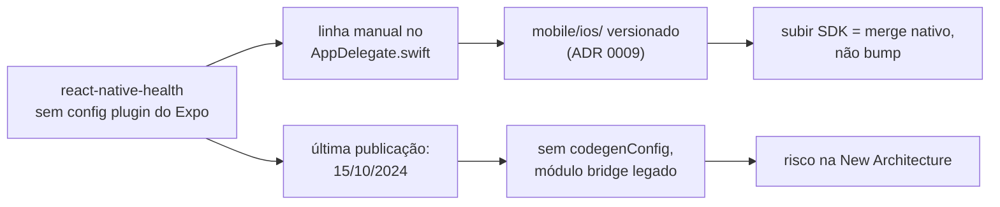

# Plano de migração — React Native 0.81.5 → 0.86 (Expo SDK 54 → 57)

**Autor:** Winston (System Architect) · **Data:** 2026-08-18 · **Status:** **concluído** — todas as fases executadas em 20/08/2026; o alvo (Expo SDK 57 / RN 0.86.2) está rodando em device

---

## 0. Estado da execução

> Atualizado em 20/08/2026. A seção "1. Estado medido" abaixo é o retrato de
> **18/08**, quando o plano foi escrito, e fica como está — é o que se sabia
> naquele momento.

| Fase | Estado | Evidência |
| --- | --- | --- |
| 0 — alinhar o SDK 54 | ✅ | `expo-doctor` 17/18; a única falha restante é o falso positivo do `app.json`, documentado no topo de `mobile/app.config.js` |
| 1B — trocar a biblioteca de HealthKit | ✅ | ADR [0012](../../docs/decisions/0012-kingstinct-healthkit-devolve-o-prebuild.md), [0013](../../docs/decisions/0013-background-do-healthkit-exige-patch-na-lib.md), [0014](../../docs/decisions/0014-remove-a-rede-de-rollback-do-react-native-health.md) |
| 1 — New Architecture no SDK 54 | ✅ | `newArchEnabled: true`; 3 portões em device (a chave saiu do `app.json` na Fase 2 — o SDK 55 a rejeita, ver abaixo) |
| 2 — SDK 55 / RN 0.83 | ✅ | `expo-doctor` 19/20, 37 suítes / 377 testes, `BUILD SUCCEEDED`; **os 3 portões passaram em device** (iPhone 17 Pro, 20/08/2026) · ADR [0015](../../docs/decisions/0015-overrides-fixam-copia-unica-e-versao-dos-patches.md) |
| 3 — SDK 56 / RN 0.85 | ✅ | código verde (`tsc`, doctor 20/22) — **sem portão em device, por decisão**: só o SDK 57 sai da regressão do Hermes, então o 56 seria um repouso abandonado em seguida. Validado pelos portões da Fase 4, que passam por cima dele |
| 4 — SDK 57 / RN 0.86 | ✅ | **alvo atingido.** `tsc` limpo *sem mudança de código*, 379 testes, `expo-doctor` 20/21 com a checagem do Hermes aprovada, `BUILD SUCCEEDED`; **os 3 portões passaram em device** (iPhone 17 Pro, 20/08/2026) |

**A Estratégia B foi escolhida**, de forma eletiva, antes de o portão da Fase 1
rodar. `react-native-health` foi removido (ADR 0014) e `mobile/ios/` voltou a
ser gerado por `expo prebuild`.

**O portão 3 passou pela primeira vez nesta base** em 20/08/2026: atividade em
`activities` com `created_at` no mesmo minuto do fim do treino, app fechado.
Não era regressão da migração — o `Info.plist` de antes dela também não
declarava `UIBackgroundModes`, e o portão nunca havia sido verificado. Fez
falta um patch local na lib nova; ver ADR 0013 para o que exatamente estava
quebrado e o que reverificar a cada upgrade dela.

**O que mudou no jeito de buildar.** A cota da EAS acabou; o build agora é local
por cabo. A receita e as pegadinhas estão em [`mobile/AGENTS.md`](../../mobile/AGENTS.md)
— resumidamente: `DEVELOPMENT_TEAM` some a cada prebuild (resolvido por
`plugins/withDevelopmentTeam.js`), o canal de OTA precisa vir de
`updates.requestHeaders` porque a EAS não o injeta mais, e o iPhone precisa
estar desbloqueado no `install`.

**O que a Fase 2 encontrou (20/08/2026).** O degrau em si foi barato: `expo install
--fix`, nenhum major de terceiro — o `gesture-handler` foi para 2.30, **não** para o
3.x que a seção 5 temia. O caro foi o que apareceu ao **regenerar o
`package-lock.json`**, coisa que subir de SDK obriga. A inércia do lockfile
escondia três duplicatas latentes (RN, React e `supabase-js`), e o patch do
`supabase-js` chegou a ser aplicado na cópia errada. A saída está na
[ADR 0015](../../docs/decisions/0015-overrides-fixam-copia-unica-e-versao-dos-patches.md):
`overrides` na raiz + `patch-package --error-on-fail`.

Três consequências que mudam as fases seguintes:

- **`newArchEnabled` saiu do `app.json`** — o schema do SDK 55 rejeita a chave,
  porque a New Architecture virou a única. A flag da Fase 1 cumpriu seu papel; o
  build confirma `RCT_NEW_ARCH_ENABLED=1` sem ela.
- **`withFmtConstevalFix.js` foi removido.** A RN 0.83.10 traz `fmt` 12.1.0 — na
  verdade nem versiona mais o `fmt` como pod separado. O plugin já documentava a
  própria validade ("remover em RN ≥ 0.83.9").
- **Reanimated e `worklets` saíram da árvore**, efeito colateral do `overrides`.
  Custou tirar `react-native-reanimated/plugin` do `babel.config.js`, que resolvia
  só pela cópia acidental.

  > **Corrigido na Fase 3.** Na hora, isto foi anotado aqui como algo que
  > "elimina o ponto de atenção da Fase 3". **Não elimina.** No SDK 56 o
  > `expo-router` passou a depender de `react-native-drawer-layout`, que exige
  > reanimated como peer obrigatório — os dois voltam à árvore, agora
  > legitimamente. E a Fase 3 mostrou que o `expo-doctor` acusa a regressão do
  > Hermes V1 pelo SDK em si, não por quem usa reanimated. O que de fato resolve
  > é o SDK 57.

O patch do `@kingstinct/react-native-healthkit` **não** foi mexido: a 14.0.2 segue
sendo a última publicada, então não houve reverificação por troca de versão. O que
o portão 3 reverificou aqui foi a troca de **RN** — e a entrega em background
sobreviveu à 0.83 com o patch da ADR 0013 intacto.

**Os 3 portões passaram em device em 20/08/2026** (iPhone 17 Pro): app abre com
navegação e mapas, a aba Saúde popula, e a sincronização em background entregou com
o app fechado.

**O que as Fases 3 e 4 encontraram (20/08/2026).** Os dois degraus foram feitos
em sequência, sem portão em device no meio — decisão explícita, porque o
`expo-doctor` do SDK 56 acusa a regressão de memória do Hermes V1 e aponta o
SDK 57 como o único conserto. Testar em aparelho um SDK que seria abandonado em
seguida custaria um build e uma rodada de portões para nada. O preço aceito: se
algo falhar nos portões, não dá para separar o que veio da RN 0.85 do que veio
da 0.86.

O SDK 56 foi o único degrau desta migração que **mexeu em código de produto**,
porque o `expo-router` trocou de motor de navegação:

- `@react-navigation/native` saiu (o doctor reprova tê-lo junto do expo-router
  a partir da 56). Nenhum arquivo o importava — só o tipo `BottomTabBarProps`
  da tab bar customizada, que passou a vir de `expo-router/build/layouts/Tabs`.
- `StyleSheet.absoluteFillObject` foi removido na RN 0.85; o `absoluteFill` que
  restou é hoje o mesmo objeto simples, então os 5 usos viraram rename.
- `backgroundColor` do StatusBar saiu na `expo-status-bar` 56 — já era no-op.
- A chave `splash` saiu do schema; foi para as opções do plugin.
- O **TypeScript 6** parou de incluir os `@types` automaticamente: sem
  `"types": ["jest"]` no `tsconfig`, os testes que usam o `jest` global não
  compilam.

O SDK 57, em contraste, foi **bump puro**: `tsc` limpo sem tocar em uma linha de
código, testes verdes, e o doctor aprovando a checagem do Hermes que reprovava
no 56.

**Os 3 portões passaram em device em 20/08/2026** (iPhone 17 Pro), fechando a
migração. E logo depois veio o achado que justifica o portão ser manual: com os
três verdes, exportar a imagem de uma atividade **falhava**. O
`saveToLibraryAsync` da `expo-media-library` não foi só depreciado no SDK 57 —
ele **lança em runtime** (a própria lib diz "will throw in runtime"). Trocado por
`Asset.create`, da API baseada em classes.

Vale reter a forma da falha, porque é a terceira vez nesta base que ela aparece
assim: build verde, `tsc` verde, 379 testes verdes, e a feature quebrada. É o
mesmo formato da ADR 0013. Os 3 portões cobrem abrir, ler HealthKit e sincronizar
em background; **não** cobrem o resto do app. Ao subir SDK, exercite também as
features que tocam API de plataforma — exportar/compartilhar, câmera, galeria,
notificações.

Duas coisas que valem para quem vier depois. O `expo install --fix` reescreve as
versões **depois** do install, então a regeneração do lockfile tem de vir por
último — fazer antes deixa `mobile/node_modules` com as versões velhas e as
duplicatas voltam. E o plugin da splash passou a **redimensionar** a arte em
1x/2x/3x em vez de copiá-la: o teste do imageset teve de trocar "mesma dimensão
da origem" por proporção entre escalas, senão passaria pulando a verificação em
silêncio, já que o imageset também mudou de nome.

**Diagnóstico disponível.** `src/lib/sync-breadcrumbs.ts` grava um log
persistente lido em Configurações → Dados. Ao investigar "não sincronizou",
olhe-o antes de supor onde quebrou — foi o que permitiu separar "o iOS não
acordou o app" de "acordou e não achou nada".

---

## 1. Estado medido

Levantado do repositório, não da memória.

| Item | Valor | Fonte |
| --- | --- | --- |
| React Native | **0.81.5** | `mobile/package.json` |
| Expo SDK | **54.0.34** | `mobile/node_modules/expo` |
| React | 19.1.0 | `mobile/package.json` |
| Arquitetura | **legada** (`newArchEnabled: false`) | `mobile/app.json:10` |
| Workflow | bare — 23 arquivos de `mobile/ios/` versionados, `android/` **não** existe no git | `git ls-files` |
| Patches | 1, pinado por nome em `@supabase+supabase-js+2.106.0` | `patches/` |

`npx expo-doctor` — 13 de 18 checagens passam. As 5 que falham:

1. **`react-native-health`: "Untested on New Architecture"** — o achado que decide o plano.
2. `@expo/fingerprint` duplicado (0.15.5 na raiz × 0.6.1 aninhado dentro de `react-native-health`).
3. 7 pacotes fora da versão do SDK 54 (6 patches + `@types/jest` 30 onde o SDK pede 29).
4. `app.json` + `app.config.js` coexistindo, com o doctor achando que o dinâmico ignora o estático (falso positivo: `app.config.js:1` faz `require('./app.json')`).
5. Projeto tem `ios/` versionado **e** propriedades de config no app config — o EAS não sincroniza `plugins`, `ios`, `splash` etc. Consequência já aceita pela ADR 0009.

## 2. Alvo

**Expo SDK 57 / React Native 0.86.**

O React Native mantém apenas as **3 últimas minors**. Com o topo em 0.87, a 0.81.5 está **fora de suporte** — sem correção de bug nem de segurança. O SDK 57 (lançado em 30/06/2026) traz RN 0.86 e React 19.2, e é descrito pela Expo como release pequeno e não-quebrador.

Mapa dos degraus — não há atalho, porque cada SDK carrega um RN:

| SDK | RN | Nota |
| --- | --- | --- |
| 54 (hoje) | 0.81 | **último** que aceita arquitetura legada |
| 55 | 0.83 | New Architecture obrigatória a partir daqui |
| 56 | 0.85 | pula a 0.84; regressão de memória do Hermes V1 **só** com `reanimated`/`worklets` — o Orbe não tem nenhum dos dois (ADR 0010) |
| 57 | 0.86 | alvo |

A partir do RN 0.82 a arquitetura legada foi removida: `newArchEnabled: false` passa a ser **ignorado**. Não existe "subir o RN e continuar no legado".

## 3. A causa raiz: `react-native-health`

Antes das fases, o fato que reorganiza tudo. Puxando o fio:



Uma única dependência produz **tanto o custo quanto o risco** desta migração. Ela é responsável por:

- **O workflow bare.** `mobile/ios/Vitale/AppDelegate.swift:30-32` carrega a edição manual que a ADR 0009 documenta. É por causa dela que `ios/` está no git e que subir SDK deixou de ser bump.
- **O risco da New Architecture.** Versão 1.19.0, publicada em **15/10/2024** — a mais recente que existe. Sem `codegenConfig`, sem TurboModule: é módulo bridge legado. Roda na New Architecture apenas pela camada de interop, que a equipe do RN diz manter "por ora".
- **O modo de falha silenciosa.** A linha é esta:

  ```swift
  if let bridge = factory.bridge {
    RCTAppleHealthKit().initializeBackgroundObservers(bridge)
  }
  ```

  `RCTBridge` é o objeto que a New Architecture aposenta. Se `factory.bridge` virar `nil`, o `if let` simplesmente **não entra** — o app compila, abre, funciona, e a sincronização do HealthKit em background morre sem crash, sem erro, sem log. É o pior tipo de quebra: só aparece dias depois, como dado faltando.

> **A suíte de testes não cobre nada disso.** Os 349 testes do mobile são de lógica pura e continuarão verdes com o app nativo quebrado. O portão desta migração é smoke manual em device físico — não `npm run test`.

## 4. Duas estratégias

### Estratégia A — migrar carregando a biblioteca

Sobe SDK a SDK mantendo `react-native-health`, apostando na camada de interop.

- **A favor:** blast radius menor por fase; nenhuma mudança na lógica de sync; reversível por fase.
- **Contra:** mantém o workflow bare, então cada uma das 4 fases custa merge nativo; e ao fim continua-se dependente de uma lib parada há ~2 anos, que já é a única a falhar no `expo-doctor`.

### Estratégia B — trocar a biblioteca, depois migrar

Substitui por [`@kingstinct/react-native-healthkit`](https://www.npmjs.com/package/@kingstinct/react-native-healthkit) **14.0.2** (publicada em 05/06/2026, módulo Expo moderno, New Architecture nativa, **com** config plugin).

- **A favor:** o config plugin elimina a edição manual do `AppDelegate` → `mobile/ios/` pode voltar a ser gerado (CNG/prebuild) → a ADR 0009 é superseded e **as fases seguintes viram bump de verdade**. Resolve a causa, não o sintoma.
- **Contra:** toca 6 arquivos que importam `AppleHealthKit` (`fitness.store.ts`, `health.store.ts`, `healthkit-workouts.ts`, `activity-sync.ts`, `workout-types.ts`, `config/health-metrics.ts`), incluindo o caminho de sync anchored e os observers de background. API diferente — é reescrita de adaptador, não troca de import.

**Minha inclinação:** começar por A até o portão da Fase 1, e deixar **o portão decidir**. Se o HealthKit em background sobreviver à New Architecture no SDK 54, A é o caminho barato e você adia B com informação. Se não sobreviver — e o `if let bridge` diz que é bem possível — B deixa de ser opcional, e é melhor descobrir isso na Fase 1, onde uma flag reverte, do que na Fase 3, onde não há mais flag.

Vale dizer o que B compra além da migração: ela é a decisão que a própria ADR 0009 já listou como "a saída limpa, e segue disponível". A migração é a ocasião que a torna barata — o trabalho nativo já está sendo feito de qualquer forma.

## 5. Fases

Cada fase tem portão de saída verificável. Nenhuma começa antes de a anterior passar.

### Fase 0 — Alinhar o SDK 54 consigo mesmo

Não move nada; remove ruído para que as fases seguintes tenham sinal limpo.

- `npx expo install --check` e aplicar os 6 patches de versão do SDK.
- `@types/jest` 30 → 29 (o SDK 54 pede 29; hoje é a única incompatibilidade major).
- Dedupe do `@expo/fingerprint` aninhado.
- Registrar o falso positivo do `app.json`/`app.config.js` para não voltar a custar atenção.

**Portão:** `npx expo-doctor` só com os 2 avisos estruturais conhecidos (CNG e `react-native-health`). `npx tsc --noEmit && npx jest` verdes. Build EAS `preview` instalada e app abrindo.

### Fase 1 — New Architecture no SDK 54 · **portão de decisão**

A Expo é explícita: **não** subir SDK e adotar New Architecture juntos — se quebrar, não se sabe qual dos dois quebrou. E o RN recomenda exatamente este degrau: ligar a New Arch na 0.81/SDK 54, testar, só então saltar.

- `newArchEnabled: true` em `mobile/app.json:10`.
- Rebuild nativo (não é `eas update` — é mudança nativa; bumpar `runtimeVersion` nos **dois** lugares que a ADR 0009 aponta: `Expo.plist` e `app.json`).
- Instalar em device físico.

**Portão — nesta ordem, e o terceiro é o que importa:**

1. App abre, telas renderizam, navegação e mapas funcionam.
2. Leitura do HealthKit sob demanda funciona (a aba Saúde popula).
3. **Sincronização em background funciona com o app fechado.** Fechar o app, gerar um treino no Apple Health, esperar, reabrir e confirmar que a atividade chegou **sem** sync manual. Antes disso, checar no log de boot se a linha do `AppDelegate` entrou — `factory.bridge` não-nil.

**Se o portão 3 falhar:** pare. Reverta a flag (ainda é possível no SDK 54 — é a última vez). O caminho passa a ser a Estratégia B, e as Fases 2–4 acontecem depois dela, já em CNG.

### Fase 1B — Troca da biblioteca *(condicional ao portão acima, ou eletiva)*

- Adaptador novo sobre `@kingstinct/react-native-healthkit`, preservando a fronteira que a AD-1 já impõe: o que é cálculo puro (`workout-types.ts`, `healthkit-workouts.ts` na parte de formato) não muda — só a borda nativa.
- Config plugin no `app.json` substituindo a edição manual do `AppDelegate`.
- `mobile/ios/` sai do git; volta o prebuild. **ADR nova superseding a 0009** (a 0009 não se edita — AD-11).

**Portão:** mesmos 3 testes da Fase 1, mais o de regressão que importa: o `sync-anchor`/`sync-queue` continua sem duplicar nem perder atividade na primeira sync após a troca.

### Fases 2, 3 e 4 — SDK 55 → 56 → 57

Uma por vez, cada uma com o mesmo ritual:

1. `npx expo install --fix` seguindo o guia oficial do SDK.
2. Nativo: `npx expo prebuild --clean` (se já em CNG) **ou** merge do projeto nativo (se ainda bare).
3. Subir as nativas de terceiros que ficaram para trás: `react-native-view-shot` 4.0.3 → 5.x, `react-native-webview` 13.15 → 14.x, `react-native-gesture-handler` 2.28 → 3.x (**major**, ler changelog), `react-native-svg`, `react-native-screens`, `react-native-safe-area-context`.
4. `npx tsc --noEmit && npx jest` — sabendo que isso valida lógica, não o nativo.
5. Build EAS `preview` + smoke em device, com os 3 portões da Fase 1 repetidos.

**Ponto de atenção na Fase 3 (SDK 56):** o `patches/@supabase+supabase-js+2.106.0.patch` está pinado por **nome de arquivo** na versão. Ele existe para neutralizar o `import()` dinâmico de OpenTelemetry que o Metro não resolve. Qualquer bump de `supabase-js` faz o `patch-package` deixar de aplicá-lo **em silêncio**, e o sintoma aparece como erro de bundle. Se subir o supabase-js em qualquer fase, regerar o patch no mesmo commit.

## 6. Riscos, na ordem em que mordem

| Risco | Probabilidade | Impacto | Mitigação |
| --- | --- | --- | --- |
| Observers de background do HealthKit morrem em silêncio na New Arch | **alta** | crítico — o app existe para isso | portão 3 da Fase 1, testado com app fechado; flag reverte no SDK 54 |
| `react-native-health` quebra de vez a partir do RN 0.83 | média | crítico | Estratégia B, já mapeada e com lib alternativa viva |
| Merge nativo do `ios/` conflita a cada SDK | alta | médio | é exatamente o custo que a Estratégia B elimina |
| Patch do supabase-js cai em silêncio | média | médio | regerar no mesmo commit do bump |
| Cota do EAS estoura no meio da migração | média | baixo | fallback por cabo validado em 29/07/2026 (ADR 0009) |
| `gesture-handler` 2 → 3 quebra a navegação | média | médio | subir isolado, num commit próprio |

## 7. O que este plano não faz

- Não sobe o React 19.1 → 19.2 por fora: ele vem junto com o SDK 56/57.
- Não toca no web nem no shared. `packages/shared` é zero-plataforma por construção (AD-1) e não vê RN.
- Não introduz `reanimated`. A ADR 0010 segue valendo — e nesta migração ela **paga dividendo**: a regressão de memória do Hermes V1 no SDK 56 atinge justamente quem usa `reanimated`/`worklets`.
- Não cria CI. Segue diferido na espinha, e não resolveria nada aqui: o que falha nesta migração é nativo, e a suíte não o enxerga.

---

**Fontes:** [React Native — Releases/Support](https://reactnative.dev/docs/releases) · [RN 0.82 — A New Era](https://reactnative.dev/blog/2025/10/08/react-native-0.82) · [Expo SDK 57 changelog](https://expo.dev/changelog/sdk-57) · [Expo SDK 56 changelog](https://expo.dev/changelog/sdk-56) · [Expo — New Architecture](https://docs.expo.dev/guides/new-architecture/) · `npx expo-doctor` nesta sessão · npm registry (versões e datas de publicação)
