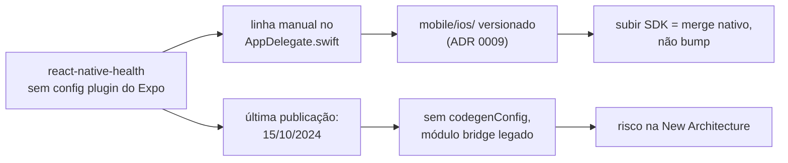

# Plano de migração — React Native 0.81.5 → 0.86 (Expo SDK 54 → 57)

**Autor:** Winston (System Architect) · **Data:** 2026-08-18 · **Status:** proposto, aguardando decisão da Fase 1

---

## 1. Estado medido

Levantado do repositório, não da memória.

| Item | Valor | Fonte |
| --- | --- | --- |
| React Native | **0.81.5** | `mobile/package.json` |
| Expo SDK | **54.0.34** | `mobile/node_modules/expo` |
| React | 19.1.0 | `mobile/package.json` |
| Arquitetura | **legada** (`newArchEnabled: false`) | `mobile/app.json:10` |
| Workflow | bare — 23 arquivos de `mobile/ios/` versionados, `android/` **não** existe no git | `git ls-files` |
| Patches | 1, pinado por nome em `@supabase+supabase-js+2.106.0` | `patches/` |

`npx expo-doctor` — 13 de 18 checagens passam. As 5 que falham:

1. **`react-native-health`: "Untested on New Architecture"** — o achado que decide o plano.
2. `@expo/fingerprint` duplicado (0.15.5 na raiz × 0.6.1 aninhado dentro de `react-native-health`).
3. 7 pacotes fora da versão do SDK 54 (6 patches + `@types/jest` 30 onde o SDK pede 29).
4. `app.json` + `app.config.js` coexistindo, com o doctor achando que o dinâmico ignora o estático (falso positivo: `app.config.js:1` faz `require('./app.json')`).
5. Projeto tem `ios/` versionado **e** propriedades de config no app config — o EAS não sincroniza `plugins`, `ios`, `splash` etc. Consequência já aceita pela ADR 0009.

## 2. Alvo

**Expo SDK 57 / React Native 0.86.**

O React Native mantém apenas as **3 últimas minors**. Com o topo em 0.87, a 0.81.5 está **fora de suporte** — sem correção de bug nem de segurança. O SDK 57 (lançado em 30/06/2026) traz RN 0.86 e React 19.2, e é descrito pela Expo como release pequeno e não-quebrador.

Mapa dos degraus — não há atalho, porque cada SDK carrega um RN:

| SDK | RN | Nota |
| --- | --- | --- |
| 54 (hoje) | 0.81 | **último** que aceita arquitetura legada |
| 55 | 0.83 | New Architecture obrigatória a partir daqui |
| 56 | 0.85 | pula a 0.84; regressão de memória do Hermes V1 **só** com `reanimated`/`worklets` — o Orbe não tem nenhum dos dois (ADR 0010) |
| 57 | 0.86 | alvo |

A partir do RN 0.82 a arquitetura legada foi removida: `newArchEnabled: false` passa a ser **ignorado**. Não existe "subir o RN e continuar no legado".

## 3. A causa raiz: `react-native-health`

Antes das fases, o fato que reorganiza tudo. Puxando o fio:



Uma única dependência produz **tanto o custo quanto o risco** desta migração. Ela é responsável por:

- **O workflow bare.** `mobile/ios/Vitale/AppDelegate.swift:30-32` carrega a edição manual que a ADR 0009 documenta. É por causa dela que `ios/` está no git e que subir SDK deixou de ser bump.
- **O risco da New Architecture.** Versão 1.19.0, publicada em **15/10/2024** — a mais recente que existe. Sem `codegenConfig`, sem TurboModule: é módulo bridge legado. Roda na New Architecture apenas pela camada de interop, que a equipe do RN diz manter "por ora".
- **O modo de falha silenciosa.** A linha é esta:

  ```swift
  if let bridge = factory.bridge {
    RCTAppleHealthKit().initializeBackgroundObservers(bridge)
  }
  ```

  `RCTBridge` é o objeto que a New Architecture aposenta. Se `factory.bridge` virar `nil`, o `if let` simplesmente **não entra** — o app compila, abre, funciona, e a sincronização do HealthKit em background morre sem crash, sem erro, sem log. É o pior tipo de quebra: só aparece dias depois, como dado faltando.

> **A suíte de testes não cobre nada disso.** Os 349 testes do mobile são de lógica pura e continuarão verdes com o app nativo quebrado. O portão desta migração é smoke manual em device físico — não `npm run test`.

## 4. Duas estratégias

### Estratégia A — migrar carregando a biblioteca

Sobe SDK a SDK mantendo `react-native-health`, apostando na camada de interop.

- **A favor:** blast radius menor por fase; nenhuma mudança na lógica de sync; reversível por fase.
- **Contra:** mantém o workflow bare, então cada uma das 4 fases custa merge nativo; e ao fim continua-se dependente de uma lib parada há ~2 anos, que já é a única a falhar no `expo-doctor`.

### Estratégia B — trocar a biblioteca, depois migrar

Substitui por [`@kingstinct/react-native-healthkit`](https://www.npmjs.com/package/@kingstinct/react-native-healthkit) **14.0.2** (publicada em 05/06/2026, módulo Expo moderno, New Architecture nativa, **com** config plugin).

- **A favor:** o config plugin elimina a edição manual do `AppDelegate` → `mobile/ios/` pode voltar a ser gerado (CNG/prebuild) → a ADR 0009 é superseded e **as fases seguintes viram bump de verdade**. Resolve a causa, não o sintoma.
- **Contra:** toca 6 arquivos que importam `AppleHealthKit` (`fitness.store.ts`, `health.store.ts`, `healthkit-workouts.ts`, `activity-sync.ts`, `workout-types.ts`, `config/health-metrics.ts`), incluindo o caminho de sync anchored e os observers de background. API diferente — é reescrita de adaptador, não troca de import.

**Minha inclinação:** começar por A até o portão da Fase 1, e deixar **o portão decidir**. Se o HealthKit em background sobreviver à New Architecture no SDK 54, A é o caminho barato e você adia B com informação. Se não sobreviver — e o `if let bridge` diz que é bem possível — B deixa de ser opcional, e é melhor descobrir isso na Fase 1, onde uma flag reverte, do que na Fase 3, onde não há mais flag.

Vale dizer o que B compra além da migração: ela é a decisão que a própria ADR 0009 já listou como "a saída limpa, e segue disponível". A migração é a ocasião que a torna barata — o trabalho nativo já está sendo feito de qualquer forma.

## 5. Fases

Cada fase tem portão de saída verificável. Nenhuma começa antes de a anterior passar.

### Fase 0 — Alinhar o SDK 54 consigo mesmo

Não move nada; remove ruído para que as fases seguintes tenham sinal limpo.

- `npx expo install --check` e aplicar os 6 patches de versão do SDK.
- `@types/jest` 30 → 29 (o SDK 54 pede 29; hoje é a única incompatibilidade major).
- Dedupe do `@expo/fingerprint` aninhado.
- Registrar o falso positivo do `app.json`/`app.config.js` para não voltar a custar atenção.

**Portão:** `npx expo-doctor` só com os 2 avisos estruturais conhecidos (CNG e `react-native-health`). `npx tsc --noEmit && npx jest` verdes. Build EAS `preview` instalada e app abrindo.

### Fase 1 — New Architecture no SDK 54 · **portão de decisão**

A Expo é explícita: **não** subir SDK e adotar New Architecture juntos — se quebrar, não se sabe qual dos dois quebrou. E o RN recomenda exatamente este degrau: ligar a New Arch na 0.81/SDK 54, testar, só então saltar.

- `newArchEnabled: true` em `mobile/app.json:10`.
- Rebuild nativo (não é `eas update` — é mudança nativa; bumpar `runtimeVersion` nos **dois** lugares que a ADR 0009 aponta: `Expo.plist` e `app.json`).
- Instalar em device físico.

**Portão — nesta ordem, e o terceiro é o que importa:**

1. App abre, telas renderizam, navegação e mapas funcionam.
2. Leitura do HealthKit sob demanda funciona (a aba Saúde popula).
3. **Sincronização em background funciona com o app fechado.** Fechar o app, gerar um treino no Apple Health, esperar, reabrir e confirmar que a atividade chegou **sem** sync manual. Antes disso, checar no log de boot se a linha do `AppDelegate` entrou — `factory.bridge` não-nil.

**Se o portão 3 falhar:** pare. Reverta a flag (ainda é possível no SDK 54 — é a última vez). O caminho passa a ser a Estratégia B, e as Fases 2–4 acontecem depois dela, já em CNG.

### Fase 1B — Troca da biblioteca *(condicional ao portão acima, ou eletiva)*

- Adaptador novo sobre `@kingstinct/react-native-healthkit`, preservando a fronteira que a AD-1 já impõe: o que é cálculo puro (`workout-types.ts`, `healthkit-workouts.ts` na parte de formato) não muda — só a borda nativa.
- Config plugin no `app.json` substituindo a edição manual do `AppDelegate`.
- `mobile/ios/` sai do git; volta o prebuild. **ADR nova superseding a 0009** (a 0009 não se edita — AD-11).

**Portão:** mesmos 3 testes da Fase 1, mais o de regressão que importa: o `sync-anchor`/`sync-queue` continua sem duplicar nem perder atividade na primeira sync após a troca.

### Fases 2, 3 e 4 — SDK 55 → 56 → 57

Uma por vez, cada uma com o mesmo ritual:

1. `npx expo install --fix` seguindo o guia oficial do SDK.
2. Nativo: `npx expo prebuild --clean` (se já em CNG) **ou** merge do projeto nativo (se ainda bare).
3. Subir as nativas de terceiros que ficaram para trás: `react-native-view-shot` 4.0.3 → 5.x, `react-native-webview` 13.15 → 14.x, `react-native-gesture-handler` 2.28 → 3.x (**major**, ler changelog), `react-native-svg`, `react-native-screens`, `react-native-safe-area-context`.
4. `npx tsc --noEmit && npx jest` — sabendo que isso valida lógica, não o nativo.
5. Build EAS `preview` + smoke em device, com os 3 portões da Fase 1 repetidos.

**Ponto de atenção na Fase 3 (SDK 56):** o `patches/@supabase+supabase-js+2.106.0.patch` está pinado por **nome de arquivo** na versão. Ele existe para neutralizar o `import()` dinâmico de OpenTelemetry que o Metro não resolve. Qualquer bump de `supabase-js` faz o `patch-package` deixar de aplicá-lo **em silêncio**, e o sintoma aparece como erro de bundle. Se subir o supabase-js em qualquer fase, regerar o patch no mesmo commit.

## 6. Riscos, na ordem em que mordem

| Risco | Probabilidade | Impacto | Mitigação |
| --- | --- | --- | --- |
| Observers de background do HealthKit morrem em silêncio na New Arch | **alta** | crítico — o app existe para isso | portão 3 da Fase 1, testado com app fechado; flag reverte no SDK 54 |
| `react-native-health` quebra de vez a partir do RN 0.83 | média | crítico | Estratégia B, já mapeada e com lib alternativa viva |
| Merge nativo do `ios/` conflita a cada SDK | alta | médio | é exatamente o custo que a Estratégia B elimina |
| Patch do supabase-js cai em silêncio | média | médio | regerar no mesmo commit do bump |
| Cota do EAS estoura no meio da migração | média | baixo | fallback por cabo validado em 29/07/2026 (ADR 0009) |
| `gesture-handler` 2 → 3 quebra a navegação | média | médio | subir isolado, num commit próprio |

## 7. O que este plano não faz

- Não sobe o React 19.1 → 19.2 por fora: ele vem junto com o SDK 56/57.
- Não toca no web nem no shared. `packages/shared` é zero-plataforma por construção (AD-1) e não vê RN.
- Não introduz `reanimated`. A ADR 0010 segue valendo — e nesta migração ela **paga dividendo**: a regressão de memória do Hermes V1 no SDK 56 atinge justamente quem usa `reanimated`/`worklets`.
- Não cria CI. Segue diferido na espinha, e não resolveria nada aqui: o que falha nesta migração é nativo, e a suíte não o enxerga.

---

**Fontes:** [React Native — Releases/Support](https://reactnative.dev/docs/releases) · [RN 0.82 — A New Era](https://reactnative.dev/blog/2025/10/08/react-native-0.82) · [Expo SDK 57 changelog](https://expo.dev/changelog/sdk-57) · [Expo SDK 56 changelog](https://expo.dev/changelog/sdk-56) · [Expo — New Architecture](https://docs.expo.dev/guides/new-architecture/) · `npx expo-doctor` nesta sessão · npm registry (versões e datas de publicação)
