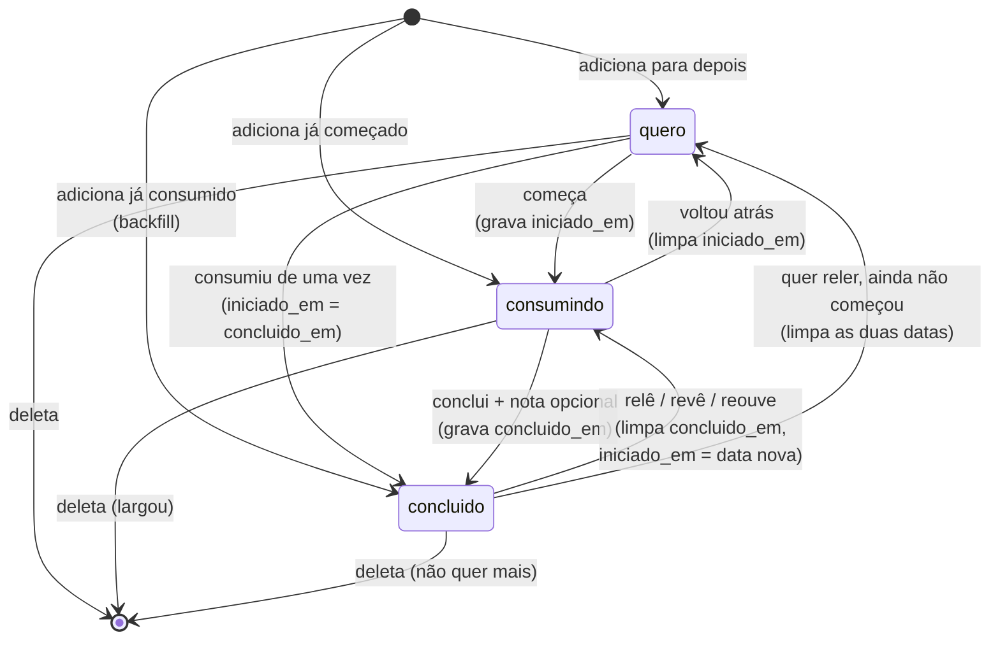

# Cultura — modelo de domínio

Companion de [spec.md](spec.md). Contém o porquê do módulo novo, a tabela única, a máquina de estados e o registro de tipos.

Schema aqui é **proposta derivada das decisões**, não migration aprovada. Nada vai a produção sem o gate do `AGENTS.md`: gerar o `.sql` em `supabase/migrations/` e perguntar.

## Por que nenhum modelo existente serve

| Modelo | Forma | Por que não comporta um item de cultura |
|---|---|---|
| `Registros` | Marca binária 1×/dia sobre item fixo | O item é fixo e o estado não evolui. "Pizza" é sempre "Pizza"; um livro sai de `quero` e chega em `concluido` |
| `Habitos` | Contador diário com meta e recorrência | "Ler" cabe como hábito — **"ler _O Nome da Rosa_" não**. O contador não guarda qual livro |
| `Tarefas` | To-do com agendamento e conclusão única | Não tem prazo, e a lista de "quero ler" não é uma lista de pendências a cobrar |

## `cultura_items`

**Tabela única.** Não há tabela de sessões — decisão explícita do usuário, registrada como non-goal.

| Coluna | Tipo | Nota |
|---|---|---|
| `id` | `uuid` pk | |
| `user_id` | `uuid` not null | RLS |
| `tipo` | `text` not null | **Sem `check`.** O conjunto válido vive no shared (CAP-9); quem valida na escrita é `cultura.ts` (CAP-13) |
| `titulo` | `text` not null | |
| `criador` | `text` | Autor, diretor, apresentador ou artista. Coluna única e consultável, em vez de quatro colunas por mídia. Nullable: nem todo provedor devolve |
| `estado` | `text` not null | `check in ('quero','consumindo','concluido')`, default `'quero'`. Vocabulário neutro — ver CAP-8 |
| `nota` | `smallint` | `check between 1 and 5`, nullable. Editável em qualquer estado (CAP-4) |
| `indicado_por` | `text` | Quem recomendou. Opcional, cross-tipo. **Coluna de topo e não `extra`**, porque precisa ser agregável — ver CAP-11 |
| `fonte` | `text` | `google_books` \| `open_library` \| `tmdb` \| `itunes` \| `musicbrainz`. **Nulo em item cadastrado à mão** |
| `fonte_id` | `text` | Id externo, para reconsultar a origem. Nulo junto com `fonte` |
| `capa_url` | `text` | Capa, pôster ou arte do álbum. Nullable — a tela usa placeholder |
| `extra` | `jsonb` | Metadado específico da mídia: `paginas`, `duracao_min`, `ano`, `n_faixas`. Mesmo padrão de `health_daily.extra` |
| `iniciado_em` | `date` | Gravada ao sair de `quero` |
| `concluido_em` | `date` | Gravada na transição para `concluido` |
| `criado_em` / `atualizado_em` | `timestamptz` | |

> `paginas` e `duracao_min` no `extra` são **metadado de catálogo**, nunca progresso. Servem para saber que o livro tem 400 páginas; jamais para saber em qual você está.

### Integridade

```sql
-- estado e datas não podem divergir
check ((estado = 'concluido') = (concluido_em is not null))
check ((estado = 'quero')     = (iniciado_em  is null))
check (concluido_em is null or concluido_em >= iniciado_em)

-- o mesmo item de catálogo não entra duas vezes;
-- item manual (fonte_id nulo) pode duplicar, é o preço do cadastro sem provedor
unique (user_id, fonte, fonte_id) where fonte_id is not null

-- indicado_por: string vazia e NULL não podem coexistir como "ninguém",
-- senão o agrupamento por indicador ganha um grupo fantasma
check (indicado_por is null or length(btrim(indicado_por)) > 0)
```

Os `check` são a última linha de defesa, não a primeira: `cultura.ts` valida os mesmos invariantes antes de escrever, para que uma edição de data inválida (CAP-12) volte como mensagem própria e não como violação de constraint do Postgres.

O `unique` também não deve ser sentido como erro. Ao adicionar um item de catálogo que já está na estante, o app **detecta antes do insert e navega ao item existente** — encontrar o que você já tem é resposta útil; um 23505 na tela não é.

O par `iniciado_em` / `concluido_em` é **todo o sinal temporal que o módulo produz** (CAP-5). Define uma janela, não dias. Item em curso tem janela aberta, fechada na consulta com `coalesce(concluido_em, current_date)`; item em `quero` não tem janela e fica fora.

## Máquina de estados



**Toda transição aceita uma data, com hoje como padrão.** Não é detalhe de UI: sem isso o backfill — adicionar o que foi consumido antes do app existir — gravaria o passado inteiro com a data de hoje, e a janela do CAP-5 nasceria errada. A data informada vale para `iniciado_em`, `concluido_em` ou ambos, conforme a transição.

Quatro coisas que o diagrama decide e valem ler duas vezes:

- **`quero → concluido` direta.** Filme visto numa sentada é o caso comum, não a exceção; forçá-lo por `consumindo` custaria dois toques sem nenhum ganho de dado. As duas datas recebem o mesmo valor.
- **`concluido → consumindo` sobrescreve.** Reler limpa `concluido_em` e grava `iniciado_em` com a **data nova, nunca a antiga** — herdar a data da primeira leitura faria a janela da releitura abranger as duas. A nota é **preservada**: é opinião sobre a obra, não sobre a leitura. A conclusão anterior se perde; o módulo guarda a última janela, não todas, e isso está declarado como non-goal.
- **`concluido → quero` existe.** Querer reler sem ter começado é estado legítimo, e sem essa aresta a fila de releitura só se montaria passando por `consumindo` — o que marcaria como em curso algo que não está.
- **`consumindo → quero` limpa `iniciado_em`.** Sem isso, item em `quero` apareceria nas consultas de janela como se estivesse em curso.

**Deleção é a única saída** (CAP-10), e sai de qualquer estado. Não há `abandonado`: largar um livro é deletá-lo. A consequência aceita é que o app não registra que houve tentativa — "comecei e larguei" e "nunca adicionei" ficam indistinguíveis, e a taxa de abandono deixa de ser uma métrica possível.

O mesmo vale para álbum e podcast: `concluido` se aplica aos quatro tipos, e um item que não faz mais sentido no app é apagado em vez de ganhar estado próprio.

## Registro de tipos (CAP-9)

O conjunto de mídias é dado no shared, não no schema. Adicionar a quinta é editar esta estrutura, sem `.sql`. O registro é **append-only**: um tipo nunca é removido, porque `tipo` não é editável (CAP-12) e removê-lo deixaria seus itens órfãos, com rótulo genérico e sem conserto que não seja deletar.

| `tipo` | Rótulos de estado (CAP-8) | `criador` é | Provedor primário | Fallback | Tipo de fallback |
|---|---|---|---|---|---|
| `livro` | quero ler · lendo · lido | Autor | Google Books · **exige chave** | Open Library · sem chave | Cobertura |
| `filme` | quero ver · vendo · visto | Diretor | TMDB · **exige chave** | iTunes Search · sem chave | Disponibilidade |
| `podcast` | quero ouvir · ouvindo · ouvido | Apresentador | iTunes Search · sem chave | — | — |
| `album` | quero ouvir · ouvindo · ouvido | Artista | iTunes Search · sem chave | MusicBrainz · sem chave | Cobertura |

**Cobertura** significa que o segundo provedor acha coisa que o primeiro não tem, e vale tentar sempre. **Disponibilidade** significa que ele quase nunca vai achar o que o primeiro não achou — existe para a busca não morrer se o TMDB cair ou a chave falhar, e não merece esforço de merge de resultados.

> **`livro` depende do Google Books, e isso exige chave.** A Open Library não tem catálogo brasileiro contemporâneo: para "Bom dia, inverno" (Tamara Klink) ela devolve 53 livros religiosos, e buscar a autora traz uma acadêmica alemã homônima. Isso é lacuna de acervo, não de query — nenhum ajuste de busca resolve. Sem `GOOGLE_BOOKS_API_KEY` o Books esbarra na cota anônima por IP (429 verificado nos IPs do Supabase e fora) e a busca degrada para a Open Library.
>
> **Lição de desenho que veio junto:** o fallback dispara em zero resultados ou erro — e a Open Library devolvia 53 resultados *irrelevantes*. "Devolveu algo" não é "devolveu algo útil", então o Google Books nunca era consultado e o cadastro manual nunca aparecia. Por isso a saída manual passou a ficar visível em toda busca, não só quando a lista volta vazia.

O fallback dispara em **dois gatilhos, não um**: zero resultados **e** erro ou timeout do provedor. Tratar só o primeiro anularia justamente o fallback de filme, cuja razão de existir é o TMDB indisponível — um 401 não é "não achou".

Esgotada a cadeia, o ramo terminal é o **cadastro manual** (CAP-1): título e tipo obrigatórios, `fonte` e `fonte_id` nulos. Podcast chega nele mais cedo que os outros, por não ter fallback.

O MusicBrainz é keyless mas não é grátis de usar: exige `User-Agent` identificando a aplicação e limita a um pedido por segundo. A edge function espaça os pedidos e, ao estourar, devolve o que já tem em vez de falhar a busca inteira — perder o fallback de álbum é aceitável, perder a busca não. Isso, mais o CORS, é o que mantém a função necessária mesmo nos tipos sem segredo.

Os rótulos são de apresentação. Nenhum deles pode vazar para nome de coluna, valor de enum ou tipo TypeScript — é o que a CAP-8 exige e o que permitiu o `tipo` crescer de dois para quatro sem tocar no `estado`.

## Onde o código mora

Consequência direta das constraints do SPEC, não decisão nova:

| Camada | Caminho | Papel |
|---|---|---|
| Dados | `packages/shared/src/data/cultura.ts` | **Único** lugar com `.from('cultura_items')`; devolve modelo de domínio e valida `tipo` na escrita (CAP-13) |
| Modelo | `packages/shared/src/models/` | `CulturaItem`, `CulturaTipo`, `CulturaEstado` + o registro de tipos acima |
| Tokens | `packages/shared/src/constants/tokens.ts` | 9ª chave no map `MOD`: `cultura: { tint: '#EBE3F3', accent: '#8B6BB1' }` |
| Busca | `supabase/functions/cultura-search/` | Fan-out multi-provedor; guarda a chave do TMDB (CAP-7), padrão de `strava-oauth` |
| Captura | `mobile/src/app/` (via aba **Mais**) | Padrão de Registros e Metas |
| Análise | `web/src/app/features/cultura/` | Rota `/cultura` |
| Migration | `supabase/migrations/` | Gerar e **perguntar** — nunca `db push` direto |
